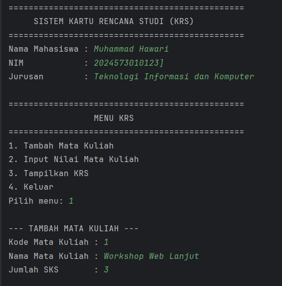
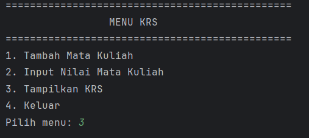
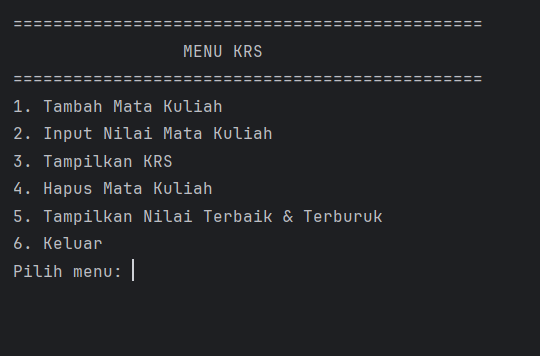
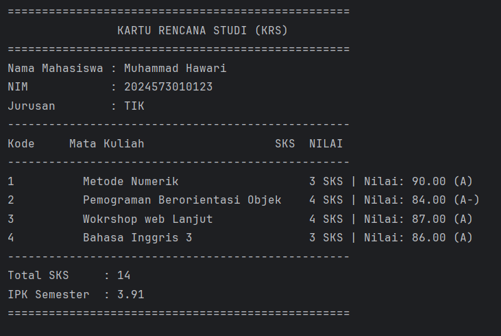
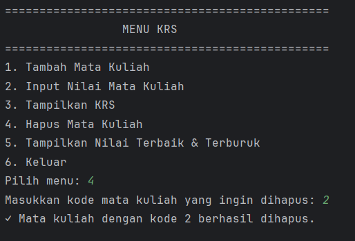
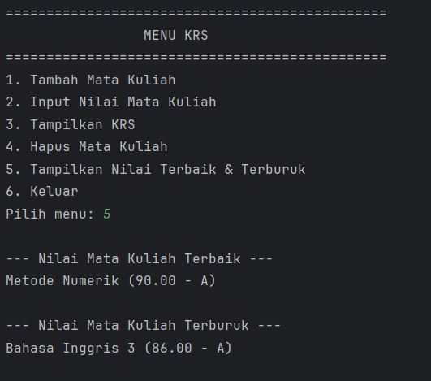

# Laporan Modul 4 : Pengenalan Objek Oriented Programming 
**Mata Kuliah:** Praktikum Pemrograman Berorientasi Objek   
**Nama:** Muhammad Hawari
**NIM:** 2024573010123  
**Kelas:** TI 2E

---

## 1. Abstrak

Laporan ini membahas penerapan konsep Pemograman Berorientasi Objek/OOP, dalam bahasa java melalui pembuatan sistem Kartu Rencana Studi(KRS).
Tujuan dari laporan ini adalah untuk memahami cara membuat dan mengimplementasikan class,object, constructor, serta hubungan antarclass seperti `Mahasiswa`, `MataKuliah`, dan `KartuRencanaStudi`.

Dalam Praktikum ini, Saya Mempelajari prinsip - prinsip dasar OOP seperti enkapsulasi, abstraksi, dan interaksi antaraobjek melalui program yang dapat menambah, menampilkan, dan menghapus mata kuliah dari KRS.
Selain itu, dilakukan pula modifikasi program dengan menambahkan fitur Validasi batas maksimal SKS (24 SKS), penghapusan mata kuliah, serta penentuan nilai mata kuliah terbaik dan terburuk.

Secara kesuluruhannya, laporan ini bertujuan untuk melatih kemampuan dalam mendesain dan mengembangkan program java berbasis objek yang efisien, terstruktur, dan sesuai dengan prinsip-prinsip OOP

---

## Teori Dasar
Objek-Oriented Programming (OOP) adalah paradigma pemrograman yang menggunakan “objek” - struktur data yang berisi data, dalam bentuk field, sering kali dikenal sebagai atribut; dan kode, dalam bentuk prosedur, sering kali dikenal sebagai metode.

Inti dari OOP adalah mendesain software dengan membagi masalah menjadi serangkaian objek yang saling berinteraksi. Ini bertentangan dengan pemrograman prosedural, yang fokus pada fungsi/prosedur dalam memproses data. OOP memungkinkan kita untuk membuat kode yang lebih modular, reusable, dan mudah di-maintain.

Konsep Dasar OOP:
`Class:` Template atau blueprint untuk membuat object

`Object:` Instance dari sebuah class

`Attribute/Field:` Variabel yang dimiliki oleh class

`Method:` Function yang dimiliki oleh class

`Constructor:` Method khusus untuk inisialisasi object


Prinsip OOP:
Encapsulation: Menyembunyikan detail implementasi
Inheritance: Pewarisan sifat dari class parent
Polymorphism: Kemampuan object untuk memiliki banyak bentuk
Abstraction: Menyederhanakan kompleksitas dengan menyembunyikan detail


## 2. Praktikum

### Class dan Object
---
kelas adalah konsep abstrak yang mendefinisikan set atribut dan metode yang akan dimiliki oleh object. Kelas menyediakan struktur atau template yang menentukan bagaimana sebuah object harus dibuat. Kelas akan menentukan jenis atribut dan metode apa yang akan dimiliki oleh object, tetapi tidak menentukan nilai dari atribut itu sendiri untuk object tertentu.

Object adalah inti dari pemrograman berorientasi objek. Setiap object memiliki dua karakteristik utama, yaitu:

Object, dalam konteks pemrograman OOP, adalah sebuah entitas yang memiliki karakteristik dan perilaku. Kelas, di sisi lain, merupakan blueprint atau cetakan untuk membuat object. Kalau kamu bandingkan dengan dunia nyata, kamu bisa menganggap kelas sebagai rencana desain bangunan, sedangkan object adalah bangunan yang sesungguhnya telah dibangun berdasarkan desain tersebut.

#### Tujuan
Memahami cara membuat class, object, dan menggunakan constructor, dan relasi class

#### Langkah - Langkah :
1. Buat class baru bernama Mahasiswa
2. Buat class `Mahasiswa` dan isikan kode berikut:

```java
package modul_4;

public class Mahasiswa {
    // Atribut/Field (bersifat private untuk menerapkan enkapsulasi)
    private String nama;
    private String nim;
    private String jurusan;

    // Constructor dengan parameter
    public Mahasiswa(String nama, String nim, String jurusan, double ipk) {
        this.nama = nama;
        this.nim = nim;
        this.jurusan = jurusan;
        // Catatan: parameter ipk belum digunakan dalam atribut
    }

    // Getter methods
    public String getNama() {
        return nama;
    }

    public String getNim() {
        return nim;
    }

    public String getJurusan() {
        return jurusan;
    }
}


```

3. buat class `MataKuliah` dan isikan kode sebagai berikut :
```java
package modul_4;

public class MataKuliah {
    private String kode;
    private String nama;
    private int sks;
    private double nilai;

    // Constructor
    public MataKuliah(String kode, String nama, int sks) {
        this.kode = kode;
        this.nama = nama;
        this.sks = sks;
        this.nilai = 0;
    }

    // Getter dan Setter
    public String getKode() {
        return kode;
    }

    public String getNama() {
        return nama;
    }

    public int getSks() {
        return sks;
    }

    public double getNilai() {
        return nilai;
    }

    public void setNilai(double nilai) {
        if (nilai >= 0 && nilai <= 100) {
            this.nilai = nilai;
        } else {
            System.out.println("Nilai harus antara 0-100!");
        }
    }

    // Konversi nilai angka ke huruf
    public String getNilaiHuruf() {
        if (nilai >= 85) return "A";
        else if (nilai >= 80) return "A-";
        else if (nilai >= 75) return "B+";
        else if (nilai >= 70) return "B";
        else if (nilai >= 65) return "C+";
        else if (nilai >= 60) return "C";
        else if (nilai >= 55) return "D";
        else return "E";
    }

    // Konversi nilai huruf ke bobot
    public double getBobotNilai() {
        String huruf = getNilaiHuruf();
        switch (huruf) {
            case "A":  return 4.0;
            case "A-": return 3.7;
            case "B+": return 3.3;
            case "B":  return 3.0;
            case "C+": return 2.7;
            case "C":  return 2.3;
            case "D":  return 1.0;
            default:   return 0.0;
        }
    }

    // Menampilkan informasi mata kuliah
    public void tampilkanInfo() {
        System.out.printf("%-10s %-30s %3d SKS | Nilai: %.2f (%s)%n",
                kode, nama, sks, nilai, getNilaiHuruf());
    }
}


```
4. Buat Class `KartuRencanaStudi` lalu buatkan Kode Sebagai Berikut :
```java
package modul_4;

public class KartuRencanaStudi {
    private Mahasiswa mahasiswa;
    private MataKuliah[] daftarMataKuliah;
    private int jumlahMataKuliah;
    private int maxMataKuliah;

    public KartuRencanaStudi(Mahasiswa mahasiswa, int maxMataKuliah) {
        this.mahasiswa = mahasiswa;
        this.maxMataKuliah = maxMataKuliah;
        this.daftarMataKuliah = new MataKuliah[maxMataKuliah];
        this.jumlahMataKuliah = 0;
    }

    // Menambah mata kuliah ke KRS
    public boolean tambahMataKuliah(MataKuliah matkul) {
        if (jumlahMataKuliah < maxMataKuliah) {
            daftarMataKuliah[jumlahMataKuliah] = matkul;
            jumlahMataKuliah++;
            System.out.println("\n✓ Note: Mata kuliah '" + matkul.getNama() + "' berhasil ditambahkan.");
            return true;
        } else {
            System.out.println("\n✗ Note: KRS sudah penuh! Maksimal = " + maxMataKuliah + " mata kuliah.");
            return false;
        }
    }

    // Menghitung total SKS
    public int hitungTotalSKS() {
        int totalSKS = 0;
        for (int i = 0; i < jumlahMataKuliah; i++) {
            totalSKS += daftarMataKuliah[i].getSks();
        }
        return totalSKS;
    }

    // Menghitung IPK
    public double hitungIPK() {
        if (jumlahMataKuliah == 0) return 0.0;

        double totalBobot = 0.0;
        int totalSKS = 0;

        for (int i = 0; i < jumlahMataKuliah; i++) {
            MataKuliah mk = daftarMataKuliah[i];
            totalBobot += mk.getBobotNilai() * mk.getSks();
            totalSKS += mk.getSks();
        }

        return totalSKS > 0 ? totalBobot / totalSKS : 0.0;
    }

    // Menampilkan isi KRS
    public void tampilkanKRS() {
        System.out.println("\n==================================================");
        System.out.println("                KARTU RENCANA STUDI (KRS)");
        System.out.println("==================================================");
        System.out.println("Nama Mahasiswa : " + mahasiswa.getNama());
        System.out.println("NIM            : " + mahasiswa.getNim());
        System.out.println("Jurusan        : " + mahasiswa.getJurusan());
        System.out.println("--------------------------------------------------");
        System.out.println("Kode     Mata Kuliah                   SKS  NILAI");
        System.out.println("--------------------------------------------------");

        if (jumlahMataKuliah == 0) {
            System.out.println("Belum ada mata kuliah yang diambil.");
        } else {
            for (int i = 0; i < jumlahMataKuliah; i++) {
                daftarMataKuliah[i].tampilkanInfo();
            }
        }

        System.out.println("--------------------------------------------------");
        System.out.println("Total SKS     : " + hitungTotalSKS());
        System.out.printf("IPK Semester  : %.2f%n", hitungIPK());
        System.out.println("==================================================\n");
    }

    // Mencari mata kuliah berdasarkan kode
    public MataKuliah cariMataKuliah(String kode) {
        for (int i = 0; i < jumlahMataKuliah; i++) {
            if (daftarMataKuliah[i].getKode().equalsIgnoreCase(kode)) {
                return daftarMataKuliah[i];
            }
        }
        return null;
    }
}

```
5. Buat Class `main` lalu buat codingan seperti berikut :
```java
package modul_4;

import java.util.Scanner;

public class main {
    public static void main(String[] args) {
        Scanner input = new Scanner(System.in);

        System.out.println("===============================================");
        System.out.println("     SISTEM KARTU RENCANA STUDI (KRS)");
        System.out.println("===============================================");

        // Input data mahasiswa
        System.out.print("Nama Mahasiswa : ");
        String nama = input.nextLine();

        System.out.print("NIM            : ");
        String nim = input.nextLine();

        System.out.print("Jurusan        : ");
        String jurusan = input.nextLine();

        // Membuat objek Mahasiswa dan KartuRencanaStudi
        Mahasiswa mhs = new Mahasiswa(nama, nim, jurusan, 0.0);
        KartuRencanaStudi krs = new KartuRencanaStudi(mhs, 10);

        boolean running = true;

        while (running) {
            System.out.println("\n===============================================");
            System.out.println("                 MENU KRS");
            System.out.println("===============================================");
            System.out.println("1. Tambah Mata Kuliah");
            System.out.println("2. Input Nilai Mata Kuliah");
            System.out.println("3. Tampilkan KRS");
            System.out.println("4. Keluar");
            System.out.print("Pilih menu: ");
            int pilihan = input.nextInt();
            input.nextLine(); // konsumsi newline

            switch (pilihan) {
                case 1:
                    System.out.println("\n--- TAMBAH MATA KULIAH ---");
                    System.out.print("Kode Mata Kuliah : ");
                    String kode = input.nextLine();

                    System.out.print("Nama Mata Kuliah : ");
                    String namaMK = input.nextLine();

                    System.out.print("Jumlah SKS       : ");
                    int sks = input.nextInt();
                    input.nextLine();

                    MataKuliah matkul = new MataKuliah(kode, namaMK, sks);
                    krs.tambahMataKuliah(matkul);
                    break;

                case 2:
                    System.out.println("\n--- INPUT NILAI ---");
                    System.out.print("Masukkan Kode Mata Kuliah : ");
                    String kodeCari = input.nextLine();

                    MataKuliah mkCari = krs.cariMataKuliah(kodeCari);
                    if (mkCari != null) {
                        System.out.print("Masukkan Nilai (0-100): ");
                        double nilai = input.nextDouble();
                        input.nextLine();
                        mkCari.setNilai(nilai);
                        System.out.println("Nilai berhasil diinput!");
                    } else {
                        System.out.println("Mata kuliah tidak ditemukan!");
                    }
                    break;

                case 3:
                    krs.tampilkanKRS();
                    break;

                case 4:
                    System.out.println("\nTerima kasih telah menggunakan sistem KRS!");
                    running = false;
                    break;

                default:
                    System.out.println("Pilihan tidak valid!");
            }
        }

        input.close();
    }
}


```
6. Menjalankan Program Output/ ujicoba terlebih dahulu



- Mengecek Tampilan KRS



- Hasil Outputnya :


---


### Tugas Praktikum

Modifikasi kode diatas sesuai dengan instruksi berikut:

- Tambahkan fitur untuk menghapus mata kuliah dari KRS
- Buat validasi agar total SKS tidak melebihi batas tertentu (misalnya 24 SKS)
- Tambahkan method untuk menampilkan mata kuliah dengan nilai terbaik dan terburuk

coding Java di bagian `KartuRencanaStudi.java` Seperti ini:

```java
package modul_4;

import java.util.Scanner;

public class main {
    public static void main(String[] args) {
        Scanner input = new Scanner(System.in);

        System.out.println("===============================================");
        System.out.println("     SISTEM KARTU RENCANA STUDI (KRS)");
        System.out.println("===============================================");

        // Input data mahasiswa
        System.out.print("Nama Mahasiswa : ");
        String nama = input.nextLine();

        System.out.print("NIM            : ");
        String nim = input.nextLine();

        System.out.print("Jurusan        : ");
        String jurusan = input.nextLine();

        // Membuat objek Mahasiswa dan KartuRencanaStudi
        Mahasiswa mhs = new Mahasiswa(nama, nim, jurusan, 0.0);
        KartuRencanaStudi krs = new KartuRencanaStudi(mhs, 10);

        boolean running = true;

        while (running) {
            System.out.println("\n===============================================");
            System.out.println("                 MENU KRS");
            System.out.println("===============================================");
            System.out.println("1. Tambah Mata Kuliah");
            System.out.println("2. Input Nilai Mata Kuliah");
            System.out.println("3. Tampilkan KRS");
            System.out.println("4. Hapus Mata Kuliah");
            System.out.println("5. Tampilkan Nilai Terbaik & Terburuk");
            System.out.println("6. Keluar");
            System.out.print("Pilih menu: ");
            int pilihan = input.nextInt();
            input.nextLine(); 

            switch (pilihan) {
                case 1:
                    System.out.println("\n--- TAMBAH MATA KULIAH ---");
                    System.out.print("Kode Mata Kuliah : ");
                    String kode = input.nextLine();

                    System.out.print("Nama Mata Kuliah : ");
                    String namaMK = input.nextLine();

                    System.out.print("Jumlah SKS       : ");
                    int sks = input.nextInt();
                    input.nextLine();

                    MataKuliah matkul = new MataKuliah(kode, namaMK, sks);
                    krs.tambahMataKuliah(matkul);
                    break;

                case 2:
                    System.out.println("\n--- INPUT NILAI ---");
                    System.out.print("Masukkan Kode Mata Kuliah : ");
                    String kodeCari = input.nextLine();

                    MataKuliah mkCari = krs.cariMataKuliah(kodeCari);
                    if (mkCari != null) {
                        System.out.print("Masukkan Nilai (0-100): ");
                        double nilai = input.nextDouble();
                        input.nextLine();
                        mkCari.setNilai(nilai);
                        System.out.println("Nilai berhasil diinput!");
                    } else {
                        System.out.println("Mata kuliah tidak ditemukan!");
                    }
                    break;

                case 3:
                    krs.tampilkanKRS();
                    break;
                    
                case 4:
                    System.out.print("Masukkan kode mata kuliah yang ingin dihapus: ");
                    String kodeHapus = input.nextLine();
                    krs.hapusMataKuliah(kodeHapus);
                    break;

                case 5:
                    krs.tampilkanNilaiTerbaikDanTerburuk();
                    break;


                case 6:
                    System.out.println("\nTerima kasih telah menggunakan sistem KRS!");
                    running = false;
                    break;

                default:
                    System.out.println("Pilihan tidak valid!");
            }
        }

        input.close();
    }
}


```

Menambahkan Fitur baru di `main.java` agar bisa diakses, lalu menambahkan dua menu baru yaitu:
```
System.out.println("5. Hapus Mata Kuliah");
System.out.println("6. Tampilkan Nilai Terbaik & Terburuk");

```

dan switch nya ditambahkan di bagian `main`:
```
case 5:
    System.out.print("Masukkan kode mata kuliah yang ingin dihapus: ");
    String kodeHapus = input.nextLine();
    krs.hapusMataKuliah(kodeHapus);
    break;

case 6:
    krs.tampilkanNilaiTerbaikDanTerburuk();
    break;

```

#### Outputnya :

Hasil yang Sudah dimodifikasi



---

#### Menggunakan Menu untuk menghapus Mata Kuliah



#### Perbandingan Tampilkan Nilai Terbaik dan Terburuk :


----

# Selesai