# Laporan Modul 2: Dasar Pemrograman Java
**Mata Kuliah:** Praktikum Pemrograman Berorientasi Objek   
**Nama:** Muhammad Hawari 
**NIM:** 2024573010123  
**Kelas:** TI 2E

---

## 1. Abstrak
Laporan ini membahas dasar-dasar pemrograman Java melalui serangkaian 
praktikum yang meliputi penggunaan variabel dan tipe data, input-output dengan kelas Scanner, 
struktur kontrol percabangan (if, if-else, switch), serta perulangan (for, while, dan do-while). 
Tujuan dari pembuatan laporan ini adalah untuk memahami konsep fundamental dalam pemrograman 
berorientasi objek menggunakan bahasa Java, khususnya dalam mengelola data, membuat keputusan logis, serta mengotomatisasi proses dengan perulangan. Melalui berbagai contoh program dan analisis, mahasiswa diharapkan mampu menerapkan konsep-konsep tersebut dalam pembuatan program interaktif yang efisien dan terstruktur.

---
## 2. Praktikum
### Praktikum 1 - Variabel Dan Tipe Data
#### Dasar Teori
Java memiliki dua kategori tipe data:

#### Tipe Data Primitif
+ byte: 8-bit signed integer (-128 to 127)
+ short: 16-bit signed integer (-32,768 to 32,767)
+ int: 32-bit signed integer (-2,147,483,648 to 2,147,483,647)
+ long: 64-bit signed integer
+ float: 32-bit IEEE 754 floating point
+ double: 64-bit IEEE 754 floating point
+ boolean: true atau false
+ char: 16-bit Unicode character
+ Tipe Data Reference
+ String, Array, Object, dll.

---

#### Langkah Praktikum
membuat variable dan tipe data
#### Aturan Penamaan Variabel
+ Dimulai dengan huruf, underscore (_), atau dollar sign ($)
+ Tidak boleh dimulai dengan angka
  Case sensitive
+ Tidak boleh menggunakan keyword Java
  Langkah 1: Variabel dan tipe data

Buat file baru dengan nama `VariabelDemo.java`
Ketik kode berikut:

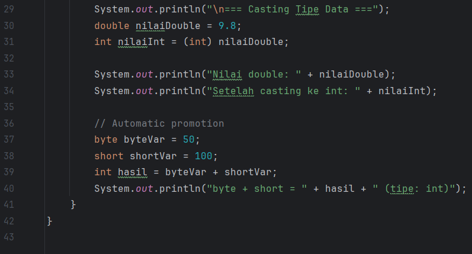
#### Screenshoot Hasil
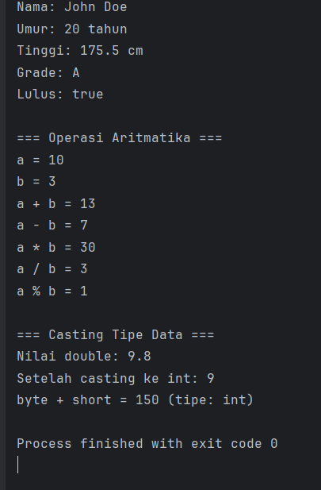

#### Analisa dan Pembahasan
1. Deklarasi dan Inisialisasi Variabel

Program mendefinisikan beberapa variabel dengan tipe data berbeda:

+ int umur = 20; → bilangan bulat (integer).
+ double tinggi = 175.5; → bilangan desimal (floating point).
+ char grade = 'A'; → karakter tunggal.
+ boolean lulus = true; → nilai logika (true/false).
+ String nama = "John Doe"; → teks atau kumpulan karakter.
#### Analisa:
+ Hal ini menunjukkan bahwa Java memiliki berbagai tipe data primitif dan non-primitif yang dapat digunakan sesuai kebutuhan.
+ Inisialisasi langsung memberikan nilai awal sehingga bisa langsung digunakan dalam program.

2. Menampilkan Nilai Variabel
Kode menggunakan System.out.println() untuk menampilkan isi variabel:
#### Contoh output :
   *Nama: John Doe*  
   *Umur: 20 tahun*
   *Tinggi: 175.5 cm*  
   *Grade: A*
   *Lulus: true*

3. Operasi Aritmatika

Program mendeklarasikan variabel a = 10 dan b = 3, lalu melakukan operasi:
+ Penjumlahan: a + b → 13
+ Pengurangan: a - b → 7
+ Perkalian: a * b → 30
+ Pembagian: a / b → 3 (karena tipe data int, hasil desimal dibulatkan ke bawah).
+ Modulus: a % b → 1 (sisa pembagian).
#### Analisa

+ Operasi aritmatika pada tipe data integer akan menghasilkan nilai integer.
+ Jika ingin hasil pecahan pada pembagian, salah satu operand harus diubah ke tipe double.

4. Casting Tipe Data

Program mendemonstrasikan casting dari double ke int:
#### contoh program :
*double nilaiDouble = 9.8;*
*int nilaiInt = (int) nilaiDouble;*

Hasil:

+ Nilai double = 9.8
+ Setelah casting ke int = 9

Analisa:

+ Casting tipe data memotong nilai desimal, bukan melakukan pembulatan.
+ Hal ini berguna ketika hanya diperlukan bagian bulat dari suatu angka.
5. Automatic Promotion

Contoh:

*byte byteVar = 50;*

*short shortVar = 100;*

*int hasil = byteVar + shortVar;*
Analisa:

+ Dalam operasi aritmatika, tipe data yang lebih kecil (byte, short) otomatis dipromosikan menjadi int.

+ Hal ini untuk menjaga konsistensi perhitungan di Java.

---

## Praktikum 2 - Input, Output dan Scanner
#### Dasar Teori
Untuk membaca input dari pengguna dalam Java, kita menggunakan class Scanner yang terdapat dalam package java.util. Scanner menyediakan berbagai method untuk membaca berbagai tipe data:
+ nextInt(): membaca integer
+ nextDouble(): membaca double
+ nextLine(): membaca String (termasuk spasi)
+ next(): membaca String (sampai spasi pertama)
+ nextBoolean(): membaca boolean

#### Langkah Praktikum
Langkah 1: Import dan Membuat Scanner

Buat file baru dengan nama `InputOutputDemo.java`
Ketik kode berikut:
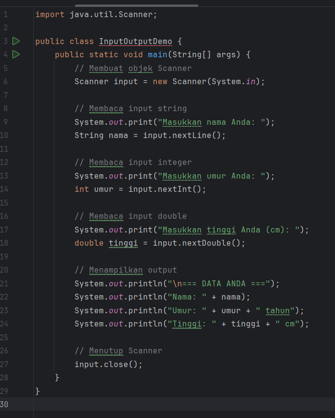

#### Screenshoot Hasil
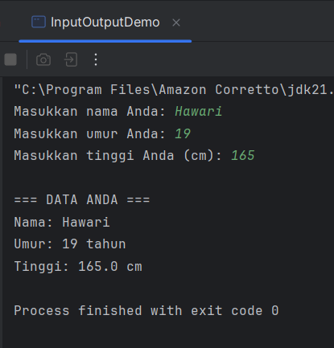
#### Analisa dan Pembahasan

#### 1. import Library Scanner
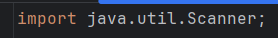
+ Scanner adalah kelas di Java yang digunakan untuk membaca input dari pengguna melalui keyboard (System.in).

+ Dengan mengimpor `java.util.Scanner`, program dapat membaca data dalam berbagai tipe (String, int, double, dll.).

#### 2. Membuat Objek Scanner
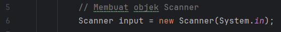
+ Membuat objek bernama input untuk menerima data dari pengguna.

+ System.in berarti data dibaca dari keyboard.

#### 3. Membaca Input String, Integer, dan Double 
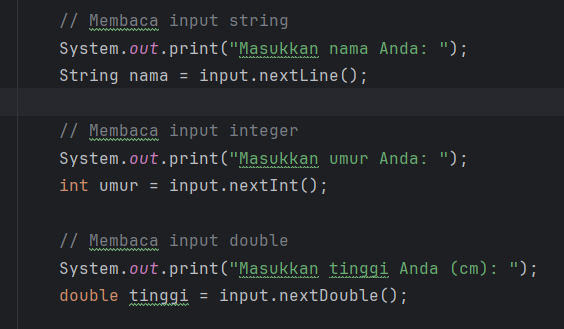
+ Program meminta pengguna mengetik nama.
+ Data disimpan ke dalam variabel nama bertipe String.
+ nextLine() digunakan agar bisa membaca seluruh teks (termasuk spasi).
#### integer
+ Program meminta umur dari pengguna.
+ Data disimpan ke dalam variabel umur bertipe int.
+ nextInt() hanya menerima angka bulat.
#### Double
+ Program meminta data tinggi badan.
+ Disimpan dalam variabel tinggi bertipe double.
+ nextDouble() digunakan untuk membaca angka dengan desimal.

#### 3. Menampilkan Output 
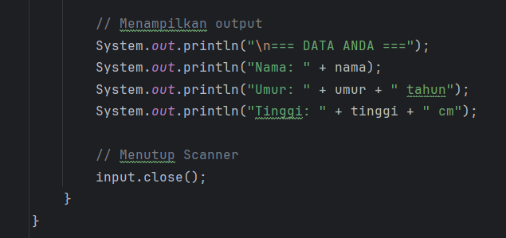
+ Program menampilkan kembali data yang sudah dimasukkan pengguna.
+ Operator + digunakan untuk menggabungkan string dengan nilai variabel.
+ Output akan lebih mudah dibaca karena disertai teks penjelas.

### KESIMPULAN
+ Program ini mendemonstrasikan cara menggunakan kelas Scanner untuk membaca input dari pengguna.
+ Program berhasil membaca String (nama), int (umur), dan double (tinggi) lalu menampilkannya kembali.
+ Dengan memanfaatkan Scanner, program dapat berinteraksi langsung dengan pengguna, sehingga lebih dinamis dibandingkan jika nilai variabel langsung diisi dalam kode.

---

## Praktikum 3 - Struktur Control Percabangan
#### Dasar Teori
Struktur kontrol percabangan digunakan untuk membuat keputusan dalam program. Java menyediakan beberapa statement percabangan:

#### 1. If Statement

        (if kondisi) {
          // kode yang dijalankan jika kondisi true`
        }

#### 2. if else statement

        if (kondisi) {
          //kode jika kondisi true
        } else {
          //kode jika kondisi false

#### 3. if-else if-else statement

         if (kondisi) {
           //kode jika kondisi true
         } else if (kondisi 2) {
           //kode jika kondisi true
         } else {
           // kode jika kondisi false
         }

#### 4. Switch Statement

    Switch (variabel){
     case nilai1:
      //kode
      break
     case nilai2:
      //kode 
      break;
     default:
        //kode default
    }

#### Langkah Praktikum
#### Langkah 1: Program Penentu Grade

  1. Buat file baru dengan nama `GradeDemo2.java`
  2. Implementasikan kode berikut:

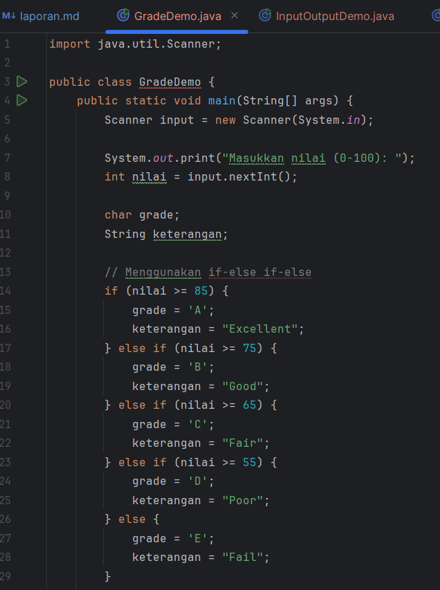
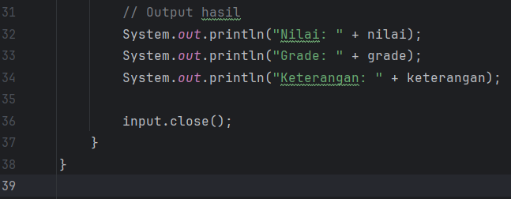

#### Langkah 2: Program Menu dengan Switch

   1. Buat file baru dengan nama `MenuDemo.java`
   2. Implementasikan kode berikut:

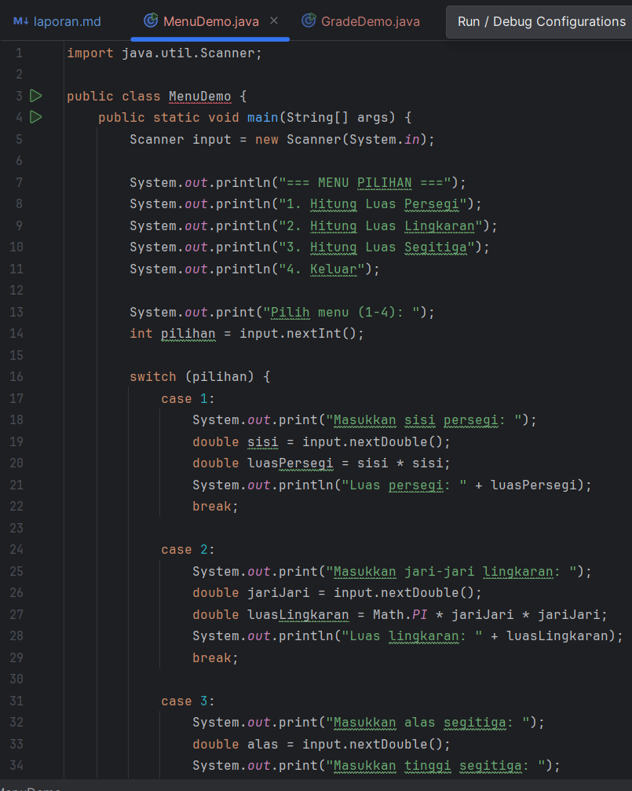
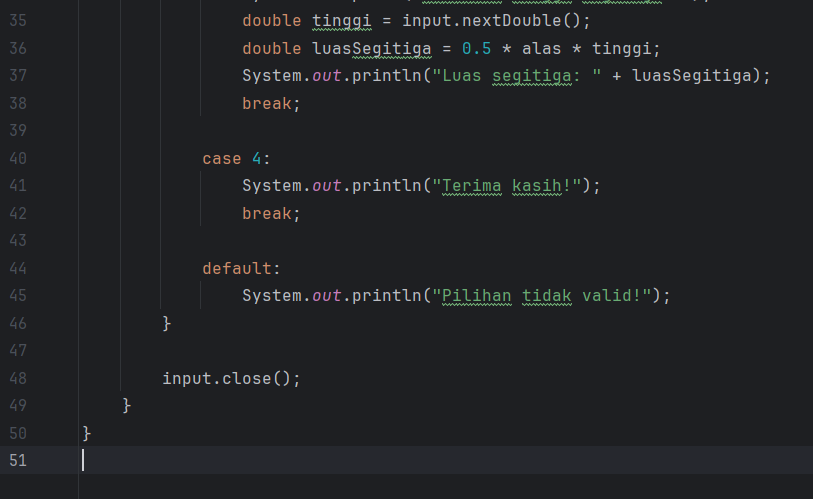

#### Langkah 3: Program Nested If

  1. Buat file baru dengan nama `NestedIfDemo.java`
  2. Implementasikan program untuk menentukan kategori usia:

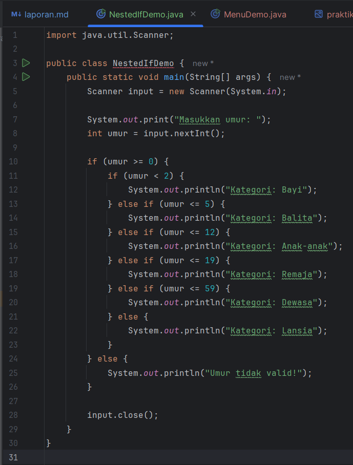

### Screenshoot Hasil
### Langkah 1: Program Penentu Grade
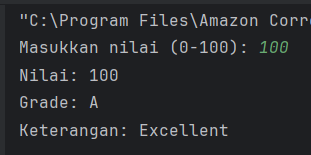

#### Jika Nilai dibuat dibawah `<55`

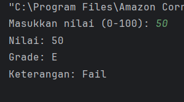

### Langkah 2: Program Menu dengan Switch
#### Output untuk Menghitung Luas Persegi
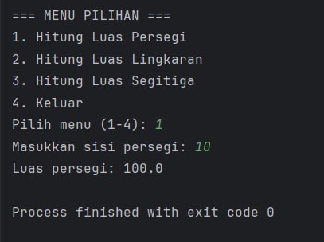

#### Output untuk Menghitung Luas Lingkaran
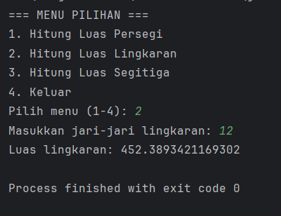

#### Output Untuk Menghitung Luas Segitiga
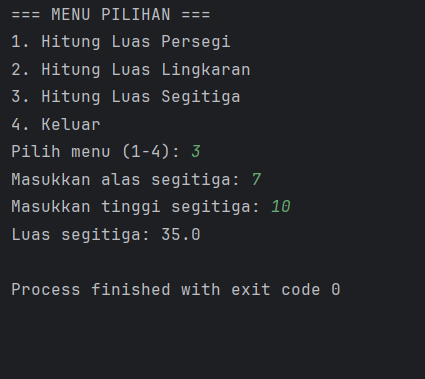

### Langkah 3: Program Nested If

##### output yang keluar jika mengetik angka 1
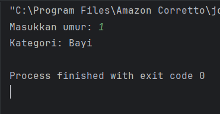

#### Output yang keluar jika mengetik angka 4
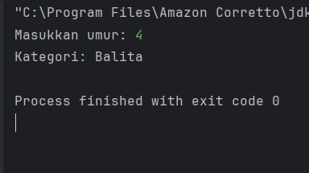

#### Output Yang Keluar Jika Mengetik angka 18
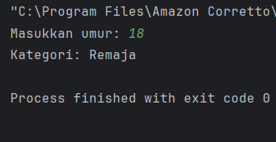

#### Output yang keluar jika mengetik tidak sesuai dengan input
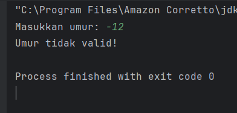

### Analisa dan Pembahasan
#### Langkah 1: Program Penentu Grade
Analisa :

#### 1. Import Scanner
        import java.util.Scanner;
Agar program bisa membaca input dari keyboard.

#### 2. Deklarasi kelas & main Method
        public class GradeDemo {
            public static void main(String[] args) {
Program utama berjalan di dalam `main.`

#### 3. Membuat scanner
        Scanner input = new Scanner(System.in);
Membuat Objek `Input` untuk Membaca nilai

#### 4. Input Nilai
        System.out.print("Masukkan nilai (0-100): ");
        int nilai = input.nextInt();
User memasukkan nilai berupa angka (integer).

#### 5. Deklarasi variabel Grade beruba angka(integer).
        char grade;
        String keterangan;

#### 6. Logika Percabangan if-Else
        if (nilai > 85) {
           grade = 'A';
           keterangan = "Excellent";
        } else if (nilai > 75) {
           grade = 'B';
           keterangan = "Good";
        } else if (nilai > 65) {
           grade = 'C';
           keterangan = "Fair";
        } else if (nilai > 55) {
           grade = 'D';
           keterangan = "Poor";
        } else {
           grade = 'E';
           keterangan = "Fail";
        }

Logika menentukan grade berdasarkan range nilai:
+ A: nilai > 85 → Excellent
+ B: nilai > 75 → Good
+ C: nilai > 65 → Fair
+ D: nilai > 55 → Poor
+ E: nilai ≤ 55 → Fail

#### 7. Output Hasil
    System.out.println("Nilai: " + nilai);
    System.out.println("Grade: " + grade);
    System.out.println("Keterangan: " + keterangan);

#### Pembahasan

Program ini bertujuan untuk menentukan grade akademik dari sebuah nilai yang dimasukkan pengguna, sekaligus memberikan keterangan dalam bahasa Inggris.
#### Tujuan utama:

+ Mengklasifikasikan nilai numerik ke dalam grade huruf (A–E).
+ Memberikan keterangan (Excellent, Good, Fair, Poor, Fail) sesuai nilai.

#### Kelebihan pendekatan ini:
+ Logika if-else cocok digunakan karena nilai berupa rentang angka.
+ Program sederhana, mudah dipahami, dan dapat dikembangkan.

#### Kekurangan:

+ Jika jumlah kategori makin banyak, if-else akan panjang.
+ Validasi input belum ada → misalnya jika nilai < 0 atau > 100, program tetap memberi grade (padahal seharusnya invalid).

#### Langkah 2: Program Menu dengan Switch

#### 1. Import Library
        import java.util.Scanner;
Digunakan agar bisa membaca input dari pengguna

#### 2. Deklarasi Kelas & `main`
        public class MenuDemo {
            public static void main(String[] args) {
                Scanner input = new Scanner(System.in);
+ Program memiliki satu kelas MenuDemo dan metode main sebagai titik masuk program.
+ Scanner input dibuat untuk membaca masukan dari keyboard.

#### 3. Tampilan Menu
    System.out.println("== MENU PILIHAN ==");
    System.out.println("1. Hitung Luas Persegi");
    System.out.println("2. Hitung Luas Lingkaran");
    System.out.println("3. Hitung Luas Segitiga");
    System.out.println("4. Keluar");
+ Menu dicetak agar pengguna tahu pilihan yang tersedia.
+ Pilihan diinput menggunakan:

    int pilihan = input.nextInt();

#### 4. Proses Pemilihan dengan Switch
    switch(pilihan) {
        case 1: ...; break;
        case 2: ...; break;
        case 3: ...; break;
        case 4: ...; break;
        default: ...;
    }
+ `switch-case` digunakan untuk mengeksekusi blok kode sesuai menu yang dipilih.
+ `break;` memastikan program keluar dari case setelah dieksekusi, agar tidak melanjutkan ke case berikutnya.
+ `default:` digunakan untuk menangani input yang tidak sesuai (selain 1–4).

#### 5. Perhitungan Matematika
a. Luas Persegi :
rumus sisi x sisi

    double luasPersegi = sisi * sisi;
b. Luas Lingkaran :
rumus : π × r × r

    double luasLingkaran = Math.PI * jariJari * jariJari;
c. Luas Segitiga :
Rumus: ½ × alas × tinggi

    double luasSegitiga = 0.5 * alas * tinggi;

#### 6.  Output
+ Hasil luas bangun datar dicetak menggunakan System.out.println().
+ Jika memilih case 4 → program mengucapkan "Terima kasih!".
+ Jika input salah → muncul pesan "Pilihan tidak valid!".

##### Analisis Logika Program

+ Case 1 → meminta input panjang sisi, lalu menghitung luas persegi.
+ Case 2 → meminta input jari-jari, lalu menghitung luas lingkaran.
+ Case 3 → meminta input alas dan tinggi, lalu menghitung luas segitiga.
+ Case 4 → keluar dari program.
+ Default → melindungi program dari input angka di luar 1–4.
+ Program ini tidak menggunakan perulangan, jadi setelah satu pilihan diproses, program langsung selesai. Jika ingin menu muncul berulang kali, perlu ditambahkan `do-while` atau `while(true).`

#### Kelebihan Program
+ Struktur kode sederhana dan mudah dipahami.
+ Menggunakan switch-case, sehingga kode lebih rapi daripada banyak if-else.
+ Sudah ada default untuk menangani input yang salah.
+ Mencakup tiga bangun datar yang sering digunakan dalam latihan.

#### Kekurangan Program
+ Tidak ada validasi input angka negatif (misalnya sisi = -5 tetap dihitung).
+ Tidak ada perulangan, jadi jika user ingin menghitung lagi harus menjalankan ulang program.
+ Tidak ada penanganan error untuk input non-numerik (jika user memasukkan huruf, program error).

### KESIMPULAN
Program MenuDemo ini merupakan contoh yang baik untuk memahami konsep switch-case dalam Java serta penerapannya dalam program interaktif sederhana. Walaupun fungsionalitasnya terbatas (tidak ada perulangan dan validasi input), struktur kode sudah cukup jelas dan mudah dipahami sebagai dasar pembuatan program menu.

#### Langkah 3: Program Nested If
1. Import Library Scanner

         import java.util.Scanner;

   Digunakan untuk membaca input dari keyboard.
2. Deklarasi kelas & Method Utama

         public class NestedIfDemo {
         public static void main(String[] args) {
Program dimulai dari method `main.`
   
3. Membuat Scanner

         Scanner input = new Scanner(System.in);
Membuat objek `input` untuk membaca data yang dimasukkan pengguna.

4. Input Umur

        System.out.print("Masukkan umur: ");
        int umur = input.nextInt();
Program meminta pengguna untuk memasukkan umur (integer).

5. Logika Percabangan (Nested If)

        if (umur >= 0) {
            if (umur < 2) {
            System.out.println("Kategori: Bayi");
        } else if (umur <= 5) {
            System.out.println("Kategori: Balita");
        } else if (umur <= 12) {
            System.out.println("Kategori: Anak-anak");
        } else if (umur <= 19) {
            System.out.println("Kategori: Remaja");
        } else if (umur <= 59) {
            System.out.println("Kategori: Dewasa");
        } else {
            System.out.println("Kategori: Lansia");
        }
        } else {
            System.out.println("Umur tidak valid!");
        }

Logika di atas memeriksa:
+ Jika umur < 0 → tidak valid.
+ Jika umur 0–1 → Bayi.
+ Jika umur 2–5 → Balita.
+ Jika umur 6–12 → Anak-anak.
+ Jika umur 13–19 → Remaja.
+ Jika umur 20–59 → Dewasa.
+ Jika umur 60 ke atas → Lansia.

#### Pembahasan

Program ini menggunakan nested if-else (if di dalam if) untuk mengelompokkan umur ke dalam kategori usia tertentu.

#### Tujuan program:
+ Mengklasifikasikan umur yang dimasukkan pengguna ke dalam kategori (Bayi, Balita, Anak-anak, Remaja, Dewasa, Lansia).
+ Jika input negatif, program memberikan pesan "Umur tidak valid!".

#### Kelebihan nested if:
+ Logika bisa ditulis lebih detail dan berurutan.
+ Cocok untuk data yang memiliki rentang nilai.

#### Kekurangan nested if:

+ Jika kondisi makin banyak, kode menjadi panjang dan agak sulit dibaca.
+ Alternatifnya bisa menggunakan if-else bertingkat biasa atau switch-case (untuk kategori yang lebih jelas, bukan range angka).

---

## Praktikum 4 - Struktur Contoh Perulangan
#### Dasar Teori

Perulangan (loop) digunakan untuk mengulang eksekusi kode tertentu. Java menyediakan tiga jenis perulangan:

1. For Loop

        for (inisialisasi; kondisi; increment/decrement) {
        // kode yang diulang
        }

2. While Loop

        while (kondisi) {
        // kode yang diulang
        }

   3. Do-While Loop

           do {
           // kode yang diulang
           } while (kondisi);

#### Langkah Praktikum
Langkah 1: Perulangan For

1. Buat file baru dengan nama `ForLoopDemo.java`
2. Implementasikan berbagai contoh for loop:
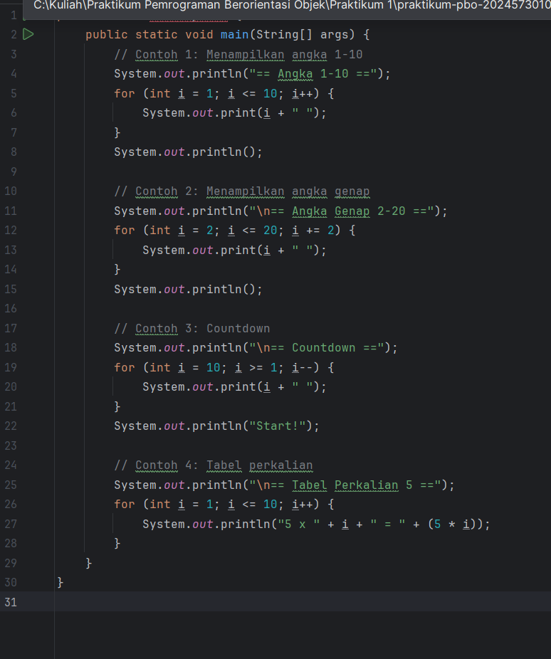

Langkah 2: Perulangan While dan Do-While

1. Buat file baru dengan nama `WhileLoopDemo.java`
2. Implementasikan contoh while dan do-while:
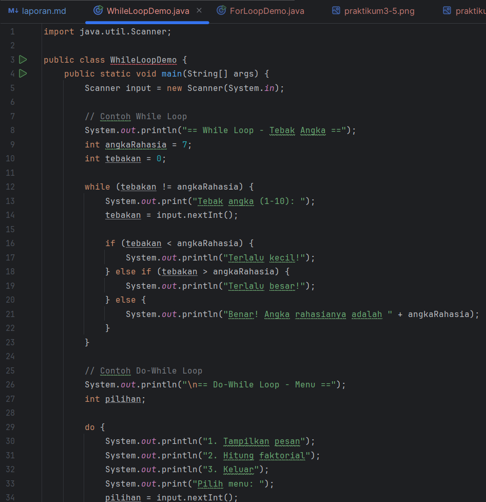

Langkah 3: Nested Loop (Perulangan Bersarang)
1. Buat file baru dengan nama `NestedLoopDemo.java`
2. Implementasikan contoh nested loop:

#### Screenshoot Hasil
#### untuk Langkah 1 : Perulangan For
menggunakan for loop

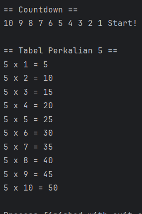

#### langkah 2 : Perulangan While dan DO-while
While loop tebak angka
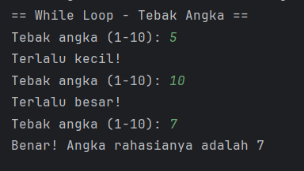

Hasil Menampilkan Pesan

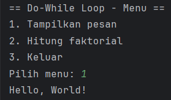

hasil menghitung faktorial

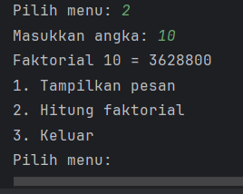

#### Langkah 3 : Nested Loop (Perulangan Bersarang)
#### Hasil Pola Bintang Segitiga

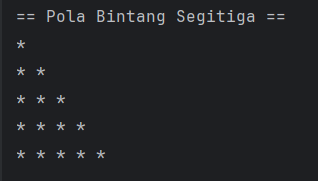

#### Hasil Tabel Perkalian 1-5 dan Pola Angka

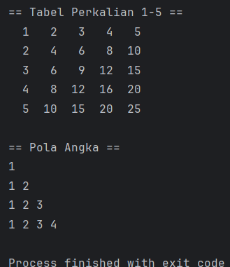
#### Analisa dan Pembahasan

#### Langkah 1 : Perulangan For
Bagian 1 : Menapilkan Angka 1-10

    for (int i = 1; i <= 10; i++) {
    System.out.print(i + " ");
    }
Analisa:
* Loop dimulai dari i = 1 hingga i = 10.
* Setiap perulangan, nilai i ditampilkan dengan spasi.

    1 2 3 4 5 6 7 8 9 10

Bagian 2 : Menampilkan Angka genap 2-20

    for (int i = 2; i <= 20; i += 2) {
    System.out.print(i + " ");
    }
Analisa:
* Loop mulai dari i = 2 dan setiap perulangan bertambah 2 (i += 2).
* Hanya menampilkan bilangan genap antara 2 sampai 20.

    2 4 6 8 10 12 14 16 18 20

Bagian 3 : Countdown

    for (int i = 10; i >= 1; i--) {
    System.out.print(i + " ");
    }
    System.out.println("Start!");

Analisa:

* Loop berjalan mundur mulai dari i = 10 hingga i = 1.
* Setelah selesai, program menampilkan "Start!".

    10 9 8 7 6 5 4 3 2 1 Start!

Bagian 4 : Tabel Perkalian

    for (int i = 1; i <= 10; i++) {
    System.out.println("5 x " + i + " = " + (5 * i));
    }
Analisa:
* Loop dari `i = 1` hingga `i = 10.`
* Pada setiap iterasi, program menghitung `5 * i` dan mencetak hasil perkalian.
* Hasilnya adalah tabel perkalian 5.

Output :

    5 x 1 = 5
    5 x 2 = 10
    5 x 3 = 15
    5 x 4 = 20
    5 x 5 = 25
    5 x 6 = 30
    5 x 7 = 35
    5 x 8 = 40
    5 x 9 = 45
    5 x 10 = 50

Kesimpulan Program :
* Contoh 1 menunjukkan penggunaan for untuk menghitung maju.
* Contoh 2 memperlihatkan penggunaan increment i += 2 untuk melompati angka (hanya bilangan genap).
* Contoh 3 menggunakan decrement i-- untuk membuat hitungan mundur (countdown).
* Contoh 4 menggunakan loop untuk membangun tabel perkalian 5.

#### Langkah 2 : Perulangan While dan Do-While
1. Bagian 1: While Loop -Tebak angka 

        int angkaRahasia = 7;
        int tebakan = 0;
        
        while (tebakan != angkaRahasia) {
            System.out.print("Tebak angka (1-10): ");
            tebakan = input.nextInt();

        if (tebakan < angkaRahasia) {
            System.out.println("Terlalu kecil!");
        } else if (tebakan > angkaRahasia) {
            System.out.println("Terlalu besar!");
        } else {
            System.out.println("Benar! Angka rahasianya adalah " + angkaRahasia);
        }
    }

#### Analisa:
* Variabel angkaRahasia diset ke angka 7.
* Program meminta user untuk memasukkan tebakan.
* Selama tebakan tidak sama dengan angka rahasia, perulangan while akan terus berjalan.
* Jika tebakan terlalu kecil → tampil "Terlalu kecil!".
Jika terlalu besar → tampil "Terlalu besar!".
Jika tepat → tampil "Benar!" dan loop berhenti.

Contoh Output (misalnya user menebak 5, 9, lalu 7):
    
    == While Loop - Tebak Angka ==
    Tebak angka (1-10): 5
    Terlalu kecil!
    Tebak angka (1-10): 9
    Terlalu besar!
    Tebak angka (1-10): 7
    Benar! Angka rahasianya adalah 7

#### Bagian 2: Do-While Loop – Menu

    int pilihan;
    
    do {
        System.out.println("1. Tampilkan pesan");
        System.out.println("2. Hitung faktorial");
        System.out.println("3. Keluar");
        System.out.print("Pilih menu: ");
        pilihan = input.nextInt();

        switch (pilihan) {
            case 1:
                System.out.println("Hello, World!");
                break;

            case 2:
                System.out.print("Masukkan angka: ");
                int n = input.nextInt();
                long faktorial = 1;
                for (int i = 1; i <= n; i++) {
                    faktorial *= i;
                }
                System.out.println("Faktorial " + n + " = " + faktorial);
                break;

            case 3:
                System.out.println("Terima kasih!");
                break;

            default:
                System.out.println("Pilihan tidak valid!");
        }
    } while (pilihan != 3);

#### Analisa
* `do-while` digunakan agar menu selalu tampil minimal sekali.
* User diminta memilih menu:
     1. Menampilkan pesan "Hello, World!"
     2. Menghitung faktorial dari suatu angka n
     3. Keluar dari program
* Perulangan akan berhenti hanya jika user memilih 3.

Contoh Output (user pilih 1, lalu 2 dengan angka 5, lalu 3):

    == Do-While Loop - Menu ==
        1. Tampilkan pesan
        2. Hitung faktorial
        3. Keluar
          Pilih menu: 1
          Hello, World!
    
        1. Tampilkan pesan
        2. Hitung faktorial
        3. Keluar
          Pilih menu: 2
          Masukkan angka: 5
          Faktorial 5 = 120
    
        1. Tampilkan pesan
        2. Hitung faktorial
        3. Keluar
             Pilih menu: 3
             Terima kasih!

#### Kesimpulan Analisis
1. While Loop cocok digunakan ketika jumlah perulangan tidak diketahui (contoh: tebak angka).
2. Do-While Loop cocok jika kita ingin menjalankan minimal sekali sebelum mengecek kondisi (contoh: menu interaktif).
3. Program ini memperlihatkan perbedaan dasar antara while dan do-while.
`while` → cek kondisi dulu, baru jalan.
` do-while` → jalankan dulu, baru cek kondisi.

#### Langkah 3 : Nested Loop
Pola bintang segitiga

    System.out.println("== Pola Bintang Segitiga ==");
    for (int i = 1; i <= 5; i++) {
    for (int j = 1; j <= i; j++) {
    System.out.print("* ");
    }
    System.out.println();
    }

Analisa:

* `i` adalah baris (1 sampai 5).
  * `j` adalah kolom yang mengikuti nilai `i.`
    * Jadi, pada baris ke-1 hanya ada 1 bintang, baris ke-2 ada 2 bintang, dan seterusnya.
    hasil :

            *
            * *
            * * * 
            * * * * 
            * * * * * 

#### Bagian 2 : Perkalian

    System.out.println("\n== Tabel Perkalian 1-5 ==");
    for (int i = 1; i <= 5; i++) {
    for (int j = 1; j <= 5; j++) {
    System.out.printf("%3d ", (i * j));
    }
    System.out.println();
    }

Analisa:

* Loop luar `(i)` mewakili baris, yaitu angka dari 1 sampai 5.
* Loop dalam `(j)` mewakili kolom, juga dari 1 sampai 5.
* `i * j` menghitung hasil perkalian.
* `printf("%3d", ...)` digunakan agar hasil rata kanan dalam lebar 3 karakter.

      1   2   3   4   5
      2   4   6   8  10
      3   6   9  12  15
      4   8  12  16  20
      5  10  15  20  25

#### Bagian 3 : Pola Angka 

    System.out.println("\n== Pola Angka ==");
    for (int i = 1; i <= 4; i++) {
    for (int j = 1; j <= i; j++) {
    System.out.print(j + " ");
    }
    System.out.println();
    }

Analisa:
* i menentukan jumlah baris (1 sampai 4).
* j berjalan dari 1 sampai i, sehingga di setiap baris jumlah angka bertambah.
* Hasilnya adalah pola segitiga angka.
Output :

        1
        1 2
        1 2 3
        1 2 3 4

#### Kesimpulan
Nested loop digunakan untuk membuat pola yang lebih kompleks.

* Loop luar = baris.

* Loop dalam = kolom / isi dari baris.

Bagian pertama menghasilkan pola bintang segitiga.
Bagian kedua membuat tabel perkalian 1–5.
Bagian ketiga menampilkan pola angka segitiga.
`System.out.printf` membantu memformat tampilan agar lebih rapi.

---

## 3. Kesimpulan
1. Perulangan `(loop)` merupakan salah satu konsep dasar pemrograman yang sangat penting untuk mengurangi pengulangan kode secara manual.

Dengan memanfaatkan variasi perulangan:
* Program dapat menampilkan deret angka (maju, genap, mundur).

* Program dapat digunakan untuk aplikasi interaktif (tebak angka, menu pilihan).

* Program dapat mencetak pola teks dan tabel perkalian secara sistematis.

2. Penggunaan perulangan membuat kode lebih efisien, ringkas, dan mudah dipahami dibanding menuliskan output secara manual.

Variabel adalah wadah penyimpanan data dalam program. Variabel digunakan untuk menyimpan nilai yang dapat berubah selama program berjalan. Setiap variabel harus memiliki nama dan tipe data agar komputer tahu bagaimana cara mengolahnya.
Tipe Data berfungsi untuk menentukan jenis data yang disimpan dalam variabel, sehingga komputer dapat mengalokasikan memori dengan tepat dan menghindari kesalahan dalam operasi.

Dalam Java, tipe data dibagi menjadi dua:

* Tipe Data Primitif, seperti:

  - `int` → untuk bilangan bulat

  - `double` / float → untuk bilangan desimal

  - `char` → untuk satu karakter

  - `boolean` → untuk logika (true/false)

* Tipe Data Non-Primitif (Referensi), seperti: String, Array, Class, dan Object.

3. Pemilihan tipe data yang tepat sangat penting karena akan berpengaruh pada:

* Efisiensi memori (contoh: gunakan int jika angka tidak terlalu besar, gunakan long jika angka lebih besar).

* Ketepatan operasi (contoh: gunakan double untuk perhitungan desimal agar lebih presisi).

4. Dengan pemahaman variabel dan tipe data, programmer dapat menulis program yang lebih efisien, terstruktur, dan bebas dari error terkait data.

---

## 5. Referensi
- Java Documentation — Oracle: The switch Statement
https://docs.oracle.com/javase/tutorial/java/nutsandbolts/switch.html
- W3Schools: Java Switch
https://www.w3schools.com/java/java_switch.asp
- Tutorialspoint — Java Switch Statement
https://www.tutorialspoint.com/java/switch_statement_in_java.htm
- Oracle. (2023). The Java™ Tutorials – Control Flow Statements. Oracle. 
https://docs.oracle.com/javase/tutorial/java/nutsandbolts/flow.html
- GeeksforGeeks — Java Switch Case Statement with Examples
https://www.geeksforgeeks.org/switch-statement-in-java/

---
