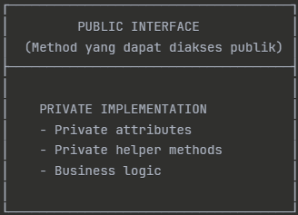
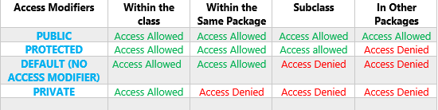
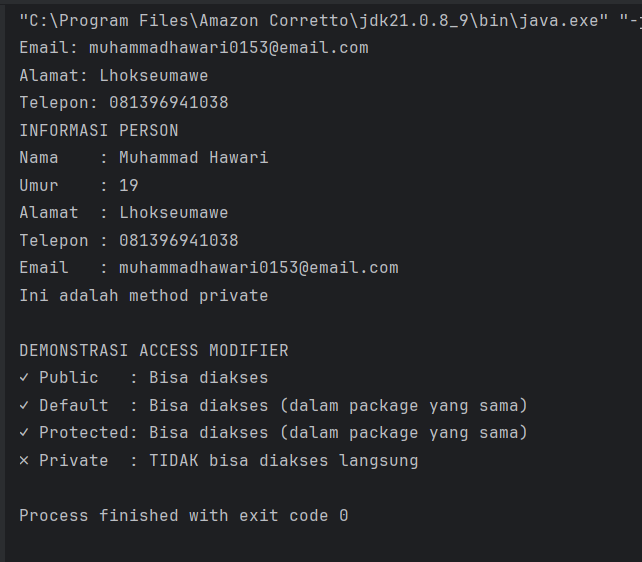
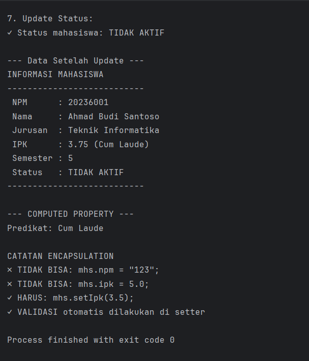
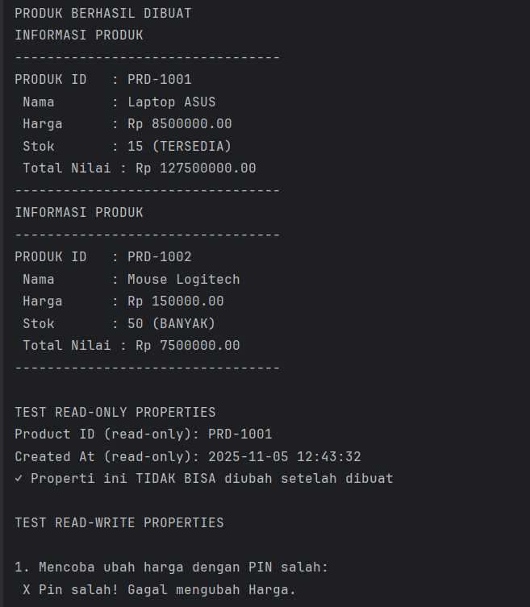
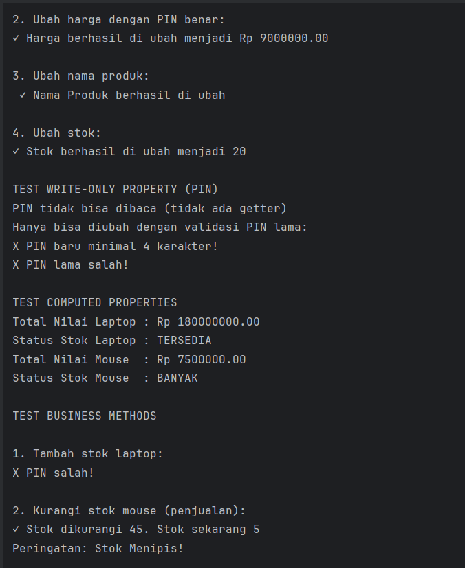
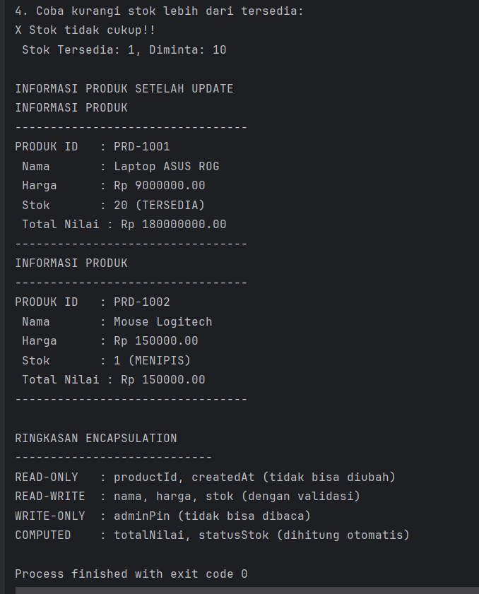

# Laporan Modul 5 : Enkapsulasi
**Mata Kuliah:** Praktikum Pemrograman Berorientasi Objek   
**Nama:** Muhammad Hawari
**NIM:** 2024573010123  
**Kelas:** TI 2E

---
## 1. Teori Dasar
Encapsulation (Enkapsulasi) adalah salah satu prinsip fundamental dalam Object-Oriented 
Programming (OOP) yang membungkus data (attributes) dan method yang bekerja pada data 
tersebut dalam satu unit (class), serta menyembunyikan detail implementasi internal dari dunia 
luar

#### Tujuan Encapsulation
+ Data Protection - Melindungi data dari akses dan modifikasi yang tidak sah.
+ Data Validation - Memastikan data yang masuk valid sebelum disimpan.
+ Flexibility - Mudah mengubah implementasi internal tanpa mempengaruhi kode luar.
+ Maintainability - Kode lebih mudah dipelihara dan di-debug.
+ Modularity - Membuat kode lebih modular dan terorganisir

##### Prinsip Utama :



#### Cara Implementasi
+ Deklarasikan attributes sebagai private.
+ Buat getter methods untuk membaca nilai attributes.
+ Buat setter methods untuk mengubah nilai attributes dengan validasi.
+ Tambahkan business logic di dalam class.

#### Access Modifier:
Access modifier menentukan tingkat akses terhadap class, attributes, dan methods. Java memiliki 4 jenis access modifier:



---

## 2. Praktikum 1 : Memahami Access Modifier

---

#### Tujuan
Memahami perbedaan dan penggunaan berbagai access modifier.

#### Langkah langkah 
1. Buat sebuah package baru di dalam package `modul_5` dengan nama `praktikum_1`
2. Buat class baru bernama `Person` dengan berbagai access modifier

```java
package modul_5.Praktikum_1;

public class person {
    private String nama;
    private int umur;

    // Default (package-private) - bisa diakses dalam package yang sama
    String alamat;

    // Protected - bisa diakses dalam package dan subclass
    protected String telepon;

    // Public - bisa diakses dari mana saja
    public String email;

    // Constructor
    public person(String nama, int umur) {
        this.nama = nama;
        this.umur = umur;
    }

    // Public method untuk menampilkan info
    public void tampilkanInfo() {
        System.out.println("INFORMASI PERSON");
        System.out.println("Nama    : " + nama);      // OK - dalam class yang sama
        System.out.println("Umur    : " + umur);      // OK - dalam class yang sama
        System.out.println("Alamat  : " + alamat);    // OK - dalam class yang sama
        System.out.println("Telepon : " + telepon);   // OK - dalam class yang sama
        System.out.println("Email   : " + email);     // OK - dalam class yang sama
    }

    // Private method - hanya bisa dipanggil dalam class ini
    private void metodePribadi() {
        System.out.println("Ini adalah method private");
    }

    // Protected method
    protected void metodeProtected() {
        System.out.println("Ini adalah method protected");
    }

    // Method untuk mengakses private method
    public void panggilMetodePribadi() {
        metodePribadi(); // OK - dalam class yang sama
    }
}


```

Buat class `AccessModifierTest` untuk testing:
```java
package modul_5.Praktikum_1;

public class AccessModifierTest {
    public static void main(String[] args) {
        person person = new person("Muhammad Hawari", 19);

        // Test akses public
        person.email = "muhammadhawari0153@email.com";     // OK - public
        System.out.println("Email: " + person.email);

        // Test akses default (dalam package yang sama)
        person.alamat = "Lhokseumawe";           // OK - dalam package yang sama
        System.out.println("Alamat: " + person.alamat);

        // Test akses protected (dalam package yang sama)
        person.telepon = "081396941038";     // OK - dalam package yang sama
        System.out.println("Telepon: " + person.telepon);

        // Test akses private - AKAN ERROR jika di-uncomment
        // person.nama = "Andi";              // ERROR - private
        // person.umur = 30;                  // ERROR - private
        // person.metodePribadi();            // ERROR - private

        // Mengakses data private melalui public method
        person.tampilkanInfo();

        // Mengakses private method melalui public method
        person.panggilMetodePribadi();

        System.out.println("\nDEMONSTRASI ACCESS MODIFIER");
        System.out.println("✓ Public   : Bisa diakses");
        System.out.println("✓ Default  : Bisa diakses (dalam package yang sama)");
        System.out.println("✓ Protected: Bisa diakses (dalam package yang sama)");
        System.out.println("✗ Private  : TIDAK bisa diakses langsung");
    }
}
```
4. Jalankan program dan amati hasilnya
5. Coba uncomment baris yang mengakses private members dan lihat error yang terjadi

#### Hasil :
Outputnya yang terlihat :



##### Analisis :

`person` — mendefinisikan tipe data/objek yang berisi atribut dan beberapa metode. (Di Java sebaiknya nama kelas Person — kapital di awal.)

`AccessModifierTest` — kelas yang berisi main() untuk menguji akses ke atribut/metode kelas person.

1) Kelas `person` — detail baris per baris / konsep
```java
package modul_5.Praktikum_1;

public class person {
    private String nama;
    private int umur;

    String alamat;               // default (package-private)
    protected String telepon;     // protected
    public String email;          // public

    public person(String nama, int umur) {
        this.nama = nama;
        this.umur = umur;
    }

    public void tampilkanInfo() {
        System.out.println("INFORMASI PERSON");
        System.out.println("Nama    : " + nama);
        System.out.println("Umur    : " + umur);
        System.out.println("Alamat  : " + alamat);
        System.out.println("Telepon : " + telepon);
        System.out.println("Email   : " + email);
    }

    private void metodePribadi() {
        System.out.println("Ini adalah method private");
    }

    protected void metodeProtected() {
        System.out.println("Ini adalah method protected");
    }

    public void panggilMetodePribadi() {
        metodePribadi();
    }
}

```
#### Atribut
`private String nama; private int umur;`

- Hanya dapat diakses dari dalam kelas person itu sendiri.
- Ini inti enkapsulasi: data sensitif disembunyikan dan hanya diakses lewat metode kelas.

+ `String alamat;` (default / package-private)
   - Dapat diakses oleh kelas lain dalam package yang sama `(modul_5.Praktikum_1)`, tapi tidak oleh kelas di package lain.

+ `protected String telepon;`

   - Dapat diakses oleh kelas dalam package yang sama dan oleh subclass (kelas turunan), walau subclass itu di package berbeda.

   - Catatan: subclass di package berbeda dapat mengakses melalui pewarisan (mis. `this.telepon`), tetapi bukan lewat objek `new person()` secara langsung jika akses dari non-subclass.

+ `public String email;`

  - Dapat diakses dari mana saja (package manapun).

#### Constructor

+ `public person(String nama, int umur)` menginisialisasi nama dan umur.

+ Sebelum constructor berjalan, field reference default diset ke `null` dan primitives ke `0` (jadi `alamat`, `telepon`, `email` = `null;` `umur` = `0`) lalu constructor menimpa `nama` dan `umur`.

#### Metode

+ `public void tampilkanInfo()` — menampilkan semua atribut termasuk private (karena berada di dalam kelas).

+ `private void metodePribadi()` — hanya bisa dipanggil di dalam kelas person. Tidak bisa dipanggil dari AccessModifierTest.

+ `protected void metodeProtected()` — dapat dipanggil oleh subclass atau kelas di package sama.

+ `public void panggilMetodePribadi()` — contoh pola untuk mengakses metode/private internals secara tidak langsung: metode publik memanggil metode private.

---

2) Kelas `AccessModifierTest` — detail dan urutan eksekusi
```java
package modul_5.Praktikum_1;

public class AccessModifierTest {
    public static void main(String[] args) {
        person person = new person("Muhammad Hawari", 19);

        person.email = "muhammadhawari0153@email.com";
        System.out.println("Email: " + person.email);

        person.alamat = "Lhokseumawe";
        System.out.println("Alamat: " + person.alamat);

        person.telepon = "081396941038";
        System.out.println("Telepon: " + person.telepon);

        // person.nama = "Andi"; // ERROR jika di-uncomment (private)
        // person.umur = 30;     // ERROR jika di-uncomment (private)
        // person.metodePribadi(); // ERROR jika di-uncomment (private)

        person.tampilkanInfo();
        person.panggilMetodePribadi();

        System.out.println("\nDEMONSTRASI ACCESS MODIFIER");
        System.out.println("✓ Public   : Bisa diakses");
        System.out.println("✓ Default  : Bisa diakses (dalam package yang sama)");
        System.out.println("✓ Protected: Bisa diakses (dalam package yang sama)");
        System.out.println("✗ Private  : TIDAK bisa diakses langsung");
    }
}

```
#### Urutan eksekusi (runtime)
1. JVM memulai `main`.

2. `new person("Muhammad Hawari", 19)` dipanggil:

   + Memory dialokasikan, field inisialisasi default (`null`, `0`).

   + Constructor dijalankan, `this.nama` dan `this.umur` diset.

3. Setelah objek dibuat, `email`, `alamat`, `telepon` di-set langsung karena `AccessModifierTest` berada dalam package yang sama sehingga diperbolehkan mengakses `default` & `protected`.

4. `System.out.println(...)` menampilkan nilai-nilai tersebut.

5. `person.tampilkanInfo()` mencetak semua field (termasuk private nama dan umur — diperbolehkan karena method itu ada di kelas person).

6. `person.panggilMetodePribadi()` memanggil method private yang mencetak teks.

7. Program menampilkan ringkasan demonstrasi.

#### Contoh error jika baris private di-uncomment

Jika kita meng-uncomment `person.nama = "Andi";` maka kompilator akan memberi error seperti:

```java

error: nama has private access in person
    person.nama = "Andi";
              ^
```

---

3) Perilaku akses di luar package / subclass
+ Dari kelas di `package` berbeda:

   + `public` → boleh.
   + `protecte`d → hanya boleh diakses jika melalui `subclass` (bukan lewat instance dari luar), contoh: `class Sub extends person { void f(){ this.telepon = "xxx"; } }` di package lain → diperbolehkan.

   + `default` (package-private) → tidak boleh.

   + `private` → tidak boleh.

+ Intinya: `default` dan `protected` mirip di package yang sama, tetapi protected juga memberi akses ke subclass di package lain.

---

## Praktikum 2: Getter dan Setter

---

#### Teori Dasar
Getter dan Setter adalah method yang digunakan untuk mengakses dan mengubah nilai private attributes.

#### Naming Convention:
+ Getter: get + NamaAttribute (contoh: getNama())
+ Setter: set + NamaAttribute (contoh: setNama())
+ Boolean Getter: is + NamaAttribute (contoh: isActive())

#### Keuntungan Menggunakan Getter/Setter:
- Kontrol akses terhadap data
- Validasi data sebelum disimpan
- Read-only atau write-only attributes
- Computed attributes
- Lazy initialization

#### Tujuan 
Memahami cara membuat dan menggunakan getter dan setter dengan benar.

#### Langkah Langkah 
1.  sebuah package baru di dalam package `modul_5` dengan nama `praktikum_2`
2. Buat class `Mahasiswa` dengan getter dan setter lengkap

```java
package modul_5.Praktikum_2;

public class Mahasiswa {
    private String npm;
    private String nama;
    private String jurusan;
    private double ipk;
    private int semester;
    private boolean aktif;

    // Constructor
    public Mahasiswa(String npm, String nama, String jurusan) {
        this.npm = npm;
        this.nama = nama;
        this.jurusan = jurusan;
        this.ipk = 0.0;
        this.semester = 1;
        this.aktif = true;
    }

    // GETTER METHODS
    public String getNpm() {
        return npm;
    }

    public String getNama() {
        return nama;
    }

    public String getJurusan() {
        return jurusan;
    }

    public double getIpk() {
        return ipk;
    }

    public int getSemester() {
        return semester;
    }

    // Boolean getter menggunakan 'is' prefix
    public boolean isAktif() {
        return aktif;
    }

    // SETTER METHODS DENGAN VALIDASI

    // NPM: Read-only (tidak ada setter)
    // Alasan: NPM tidak boleh diubah setelah dibuat

    public void setNama(String nama) {
        // Validasi: Nama tidak boleh kosong
        if (nama == null || nama.trim().isEmpty()) {
            System.out.println("✗ Nama tidak boleh kosong!");
            return;
        }

        // Validasi: Nama hanya huruf dan spasi
        if (!nama.matches("[a-zA-Z ]+")) {
            System.out.println("✗ Nama hanya boleh berisi huruf dan spasi!");
            return;
        }

        this.nama = nama;
        System.out.println("✓ Nama berhasil diubah menjadi: " + nama);
    }

    public void setJurusan(String jurusan) {
        if (jurusan == null || jurusan.trim().isEmpty()) {
            System.out.println("✗ Jurusan tidak boleh kosong!");
            return;
        }

        this.jurusan = jurusan;
        System.out.println("✓ Jurusan berhasil diubah menjadi: " + jurusan);
    }

    public void setIpk(double ipk) {
        // Validasi: IPK antara 0.0 - 4.0
        if (ipk < 0.0 || ipk > 4.0) {
            System.out.println("✗ IPK harus antara 0.0 - 4.0!");
            return;
        }

        this.ipk = ipk;
        System.out.printf("✓ IPK berhasil diubah menjadi: %.2f%n", ipk);

        // Cek status akademik berdasarkan IPK
        cekStatusAkademik();
    }

    public void setSemester(int semester) {
        // Validasi: Semester antara 1 - 14
        if (semester < 1 || semester > 14) {
            System.out.println("✗ Semester harus antara 1 - 14!");
            return;
        }

        this.semester = semester;
        System.out.println("✓ Semester berhasil diubah menjadi: " + semester);
    }

    public void setAktif(boolean aktif) {
        this.aktif = aktif;
        String status = aktif ? "AKTIF" : "TIDAK AKTIF";
        System.out.println("✓ Status mahasiswa: " + status);
    }

    // HELPER METHODS (PRIVATE)
    private void cekStatusAkademik() {
        if (ipk < 2.0) {
            System.out.println("⚠ Peringatan: IPK di bawah standar!");
        } else if (ipk >= 3.5) {
            System.out.println("★ Excellent! IPK sangat baik!");
        }
    }

    // PUBLIC METHODS
    public String getPredikat() {
        if (ipk > 3.5) return "Cum Laude";
        else if (ipk > 3.0) return "Sangat Baik";
        else if (ipk > 2.5) return "Baik";
        else if (ipk > 2.0) return "Cukup";
        else return "Kurang";
    }

    public void tampilkanInfo() {
        System.out.println("INFORMASI MAHASISWA");
        System.out.println("---------------------------");
        System.out.println(" NPM      : " + npm);
        System.out.println(" Nama     : " + nama);
        System.out.println(" Jurusan  : " + jurusan);
        System.out.printf(" IPK      : %.2f (%s)%n", ipk, getPredikat());
        System.out.println(" Semester : " + semester);
        System.out.println(" Status   : " + (aktif ? "AKTIF" : "TIDAK AKTIF"));
        System.out.println("---------------------------");
    }

    // MAIN METHOD UNTUK TESTING
    public static void main(String[] args) {
        Mahasiswa mhs = new Mahasiswa("2310117000001", "Budi Santoso", "Informatika");

        mhs.tampilkanInfo();
        System.out.println();

        // Test setter dengan validasi
        mhs.setNama("Andi Saputra");
        mhs.setJurusan("Teknik Komputer");
        mhs.setIpk(3.75);
        mhs.setSemester(5);
        mhs.setAktif(true);

        System.out.println();
        mhs.tampilkanInfo();
    }
}

```

3. Buat class `GetterSetterTest`:

```java
package modul_5.Praktikum_2;

public class GetterSetterTest {
    public static void main(String[] args) {
        System.out.println("TEST GETTER DAN SETTER\n");

        // Membuat object mahasiswa
        Mahasiswa mhs = new Mahasiswa("20236001", "Budi Santoso", "Teknik Informatika");

        System.out.println("--- Data Awal ---");
        mhs.tampilkanInfo();

        // Test GETTER
        System.out.println("\n--- TEST GETTER ---");
        System.out.println("Mengambil data menggunakan getter:");
        System.out.println("NPM      : " + mhs.getNpm());
        System.out.println("Nama     : " + mhs.getNama());
        System.out.println("Jurusan  : " + mhs.getJurusan());
        System.out.println("IPK      : " + mhs.getIpk());
        System.out.println("Semester : " + mhs.getSemester());
        System.out.println("Aktif    : " + mhs.isAktif());

        // Test SETTER dengan validasi
        System.out.println("\n--- TEST SETTER ---");

        // Test 1: Update IPK valid
        System.out.println("\n1. Update IPK (valid):");
        mhs.setIpk(3.75);

        // Test 2: Update IPK invalid
        System.out.println("\n2. Update IPK (invalid):");
        mhs.setIpk(5.0); // Akan ditolak

        // Test 3: Update nama valid
        System.out.println("\n3. Update Nama (valid):");
        mhs.setNama("Ahmad Budi Santoso");

        // Test 4: Update nama invalid
        System.out.println("\n4. Update Nama (invalid - mengandung angka):");
        mhs.setNama("Budi123"); // Akan ditolak

        // Test 5: Update semester valid
        System.out.println("\n5. Update Semester:");
        mhs.setSemester(5);

        // Test 6: Update semester invalid
        System.out.println("\n6. Update Semester (invalid):");
        mhs.setSemester(20); // Akan ditolak

        // Test 7: Update status aktif
        System.out.println("\n7. Update Status:");
        mhs.setAktif(false);

        // Tampilkan data akhir
        System.out.println("\n--- Data Setelah Update ---");
        mhs.tampilkanInfo();

        // Demonstrasi computed property
        System.out.println("\n--- COMPUTED PROPERTY ---");
        System.out.println("Predikat: " + mhs.getPredikat());

        // Tidak bisa akses langsung (akan error jika diaktifkan)
        System.out.println("\nCATATAN ENCAPSULATION");
        System.out.println("✗ TIDAK BISA: mhs.npm = \"123\";");
        System.out.println("✗ TIDAK BISA: mhs.ipk = 5.0;");
        System.out.println("✓ HARUS: mhs.setIpk(3.5);");
        System.out.println("✓ VALIDASI otomatis dilakukan di setter");
    }
}

```
4. Jalankan program dan amati:
- Getter berfungsi untuk membaca data
- Setter melakukan validasi sebelum mengubah data
- Beberapa attribute bersifat read-only (tidak ada setter)


#### Outputnya :


---

#### Analisis

1️. Class Mahasiswa
#### Tujuan Class
Kelas ini merepresentasikan objek mahasiswa lengkap dengan data pribadi dan status akademik. Semua data dibuat private untuk menerapkan enkapsulasi, sehingga hanya bisa diakses melalui getter dan setter.

Atribut (Field)

    private String npm;
    private String nama;
    private String jurusan;
    private double ipk;
    private int semester;
    private boolean aktif;

- Semua atribut bersifat private, jadi tidak dapat diakses langsung dari luar class.
Contoh: `mhs.ipk = 4.0;` -> error (karena private)

- Hal ini menjaga agar data tidak bisa diubah secara sembarangan.
Setiap perubahan harus lewat setter yang memiliki validasi.
---

#### Constructor
```java
public Mahasiswa(String npm, String nama, String jurusan) {
    this.npm = npm;
    this.nama = nama;
    this.jurusan = jurusan;
    this.ipk = 0.0;
    this.semester = 1;
    this.aktif = true;
}

```
+ Konstruktor ini otomatis dijalankan saat objek baru dibuat.

+ Nilai default:

   - IPK = 0.0

  - Semester = 1

  - Aktif = true

+ `npm`, `nama`, `jurusan` wajib diisi saat objek dibuat.
---

#### Getter Methods
Getter digunakan untuk mengambil data private.

Contohnya :
```java
public String getNama() {
    return nama;
}

```
Getter bersifat read-only — hanya mengembalikan nilai tanpa mengubah data.

| Method        | Mengembalikan | Keterangan             |
|---------------|---------------|------------------------|
| `GetNpm()`    | String        | NPM Mahasiswa          |
| `GetNama()`   | String        | Nama Mahasiswa         |
| `getJurusan()` | String        | Jurusan                |
| `getIPK()`    | Double        | IPK Terakhir           |
| `getSemester()` | int           | Smester Aktif          |
| `isAktif()`    | boolean       | Status AKtif Mahasiswa |
`isAktif()` menggunakan awalan is karena konvensi Java untuk tipe `boolean`.

---

#### Setter Methods (dengan Validasi)
Setter digunakan untuk mengubah nilai atribut private dengan validasi logika tertentu agar data tetap benar.

`setNama(String nama)`

- Cek apakah nama kosong ->  Ditolak

- Cek apakah nama mengandung angka/simbol -> Ditolak

- Jika valid -> Diterima dan tampil pesan berhasil

```java
if (!nama.matches("[a-zA-Z ]+")) {
    System.out.println("✗ Nama hanya boleh berisi huruf dan spasi!");
    return;
}
```
`setJurusan(String jurusan)`

- Tidak boleh kosong.

- Jika valid, akan disimpan ke atribut.

---

`setIpk(double ipk)`

-  rentang: 0.0 ≤ IPK ≤ 4.0

- Jika valid → ubah nilai IPK + tampilkan predikat akademik otomatis.

- Jika IPK < 2.0, muncul peringatan:

```yaml
⚠ Peringatan: IPK di bawah standar!

```
Jika IPK ≥ 3.5, muncul:

    Excellent! IPK sangat baik!

---

`setSemester(int semester)`

- Validasi: semester antara 1–14.

- Jika tidak valid → muncul pesan error.

---

`setAktif(boolean aktif)`

- Mengubah status aktif mahasiswa.

- Menampilkan status terkini (“AKTIF” atau “TIDAK AKTIF”).

---

#### Private Helper Method
```java
private void cekStatusAkademik()
```
+ Dipanggil otomatis setiap kali IPK berubah.
+ Menentukan peringatan atau pujian berdasarkan nilai IPK.

---

#### Computed Property
```java
public String getPredikat()
```
- Mengembalikan predikat akademik berdasarkan IPK tanpa menyimpannya dalam variabel.
- Disebut computed property karena nilainya dihitung otomatis.

| IPK range | Predikat    |
|-----------|-------------|
| 3.5       | Cum Laude   |
| 3.0       | Sangat Baik |
| 2.5       | baik        |
| 2.0       | cukup       |
| ≤2.0      | kurang      |

---

Method Tambahan :
```java
public void tampilkanInfo()
```

- Menampilkan seluruh data mahasiswa secara rapi.
- Memanggil getPredikat() untuk menampilkan IPK sekaligus predikatnya.

---

2. Class `GetterSetterTest`
#### Tujuan Class
Kelas ini berfungsi untuk menguji penggunaan getter dan setter dari class Mahasiswa, serta memperlihatkan validasi data dan hasil akhirnya.

---

#### Langkah Eksekusi Program
1. Membuat objek

        Mahasiswa mhs = new Mahasiswa("20236001", "Budi Santoso", "Teknik Informatika");

2. Menampilkan data awal

Memanggil `tampilkanInfo()` untuk melihat data default (IPK 0.0, semester 1, aktif true).

3. Menguji getter

Menampilkan hasil dari setiap getter:

    System.out.println("Nama     : " + mhs.getNama());
    System.out.println("Jurusan  : " + mhs.getJurusan());

4. Menguji setter dengan validasi

Beberapa skenario diujikan:

| No | Pengujian                         | Hasil                        |
|----|-----------------------------------|------------------------------|
| 1. | `mhs.setIpk(3.75)`                | Valid                        |
| 2. | `mhs.setIpk(5.0)`                 | Ditolak (“IPK harus antara 0.0–4.0”) |
| 3. | `mhs.setNama("Ahmad Budi Santoso")` |Valid                           |
| 4. | `mhs.setNama("Budi123")`          |Ditolak (“Nama hanya boleh berisi huruf dan spasi”)|
| 5. | `mhs.setSemester(5)`              |  Valid                            |
| 6. | `mhs.setSemester(20)`             |Ditolak (“Semester harus antara 1–14”)|
| 7. | `mhs.setAktif(false)`             | Ganti status ke “TIDAK AKTIF” |

5. Menampilkan hasil akhir

Menjalankan `mhs.tampilkanInfo()` lagi untuk memastikan perubahan berhasil.

6. Menampilkan computed property

Menampilkan predikat dari IPK saat ini:

    System.out.println("Predikat: " + mhs.getPredikat());

7. Menjelaskan konsep enkapsulasi

Di bagian akhir, program memberi catatan:

    ✗ TIDAK BISA: mhs.npm = "123";
    ✗ TIDAK BISA: mhs.ipk = 5.0;
    ✓ HARUS: mhs.setIpk(3.5);
    ✓ VALIDASI otomatis dilakukan di setter

Ini menjelaskan bahwa atribut tidak bisa diakses langsung karena bersifat private.

---

Kesimpulan Analisis

#### Konsep utama:
Program ini menerapkan enkapsulasi dengan sempurna:

- Semua atribut `private`

- Akses hanya melalui `getter` dan `setter`

- Setiap `setter` punya validasi logika bisnis

- Ada computed property `(getPredikat)` yang menghitung nilai berdasarkan kondisi

#### Tujuan akademik:
Menunjukkan bahwa:

- Getter digunakan untuk membaca nilai aman.

- Setter digunakan untuk mengubah nilai dengan validasi.

- Enkapsulasi menjaga data tetap konsisten dan terlindungi.

#### Output utama (contoh singkat):

```yaml
--- Data Awal ---
INFORMASI MAHASISWA
NPM      : 20236001
Nama     : Budi Santoso
Jurusan  : Teknik Informatika
IPK      : 0.00 (Kurang)
Semester : 1
Status   : AKTIF

✓ IPK berhasil diubah menjadi: 3.75
★ Excellent! IPK sangat baik!
✗ IPK harus antara 0.0 - 4.0!
✓ Nama berhasil diubah menjadi: Ahmad Budi Santoso
✗ Nama hanya boleh berisi huruf dan spasi!
✓ Semester berhasil diubah menjadi: 5
✗ Semester harus antara 1 - 14!
✓ Status mahasiswa: TIDAK AKTIF

--- Data Setelah Update ---
Nama     : Ahmad Budi Santoso
IPK      : 3.75 (Cum Laude)
Status   : TIDAK AKTIF

```

---
### Praktikum 3: Read-Only dan Write-Only Properties
---

#### Tujuan
Memahami konsep read-only dan write-only properties menggunakan getter/setter.

#### Langkah langkah
1. Buat sebuah package baru di dalam package `modul_5` dengan nama `praktikum_3`
2. Buat class `Product` dengan berbagai jenis properties:

```java
package modul_5.Praktikum_3;

import java.time.LocalDateTime;
import java.time.format.DateTimeFormatter;

public class Product {
    private final String productId;
    private final LocalDateTime createdAt;

    private String nama;
    private double harga;
    private int stok;

    private String adminPin;

    private static int counter = 1000;

    public Product(String nama, double harga, int stok, String adminPin) {
        this.productId = generateProductId();
        this.createdAt = LocalDateTime.now();
        this.nama = nama;
        this.harga = harga;
        this.stok = stok;
        this.adminPin = adminPin;
    }

    private String generateProductId() {
        counter++;
        return "PRD-" + counter;
    }

    private boolean validatePin(String adminPin) {
        return this.adminPin.equals(adminPin);
    }

    public  String getProductId() {
        return productId;
    }

    public String getCreatedAt() {
        DateTimeFormatter formatter = DateTimeFormatter.ofPattern("yyyy-MM-dd HH:mm:ss");
        return createdAt.format(formatter);
    }

    public String getNama() {
        return nama;
    }

    public void setNama(String nama, String pin) {
        if (!validatePin(pin)) {
            System.out.println(" X PIN salah! Gagal mengubah nama.");
            return;
        }

        if (nama == null || nama.trim().isEmpty()) {
            System.out.println(" X Nama Produk tidak boleh kosong!");
            return;
        }

        this.nama = nama;
        System.out.println(" ✓ Nama Produk berhasil di ubah");
    }

    public double getHarga() {
        return harga;
    }

    public void setHarga(double harga, String pin) {
        if (!validatePin(pin)) {
            System.out.println(" X Pin salah! Gagal mengubah Harga. ");
            return;
        }

        if (harga < 0) {
            System.out.println(" X Harga tidak boleh Negatif!");
            return;
        }

        this.harga = harga;
        System.out.printf("✓ Harga berhasil di ubah menjadi Rp %.2f\n", harga);
    }

    public int getStok() {
        return stok;
    }

    public void setStok(int stok, String pin) {
        if (!validatePin(pin)) {
            System.out.println("X PIN salah! Gagal mengubah Stok.");
            return;
        }

        if (stok < 0) {
            System.out.println("X Stok tidak boleh Negatif!");
            return;
        }

        this.stok = stok;
        System.out.println("✓ Stok berhasil di ubah menjadi " + stok);
    }

    public void changeAdminPin(String oldPin, String newPin) {
        if (!validatePin(oldPin)) {
            System.out.println("X PIN lama salah!");
            return;
        }

        if (newPin.length() <= 4) {
            System.out.println("X PIN baru minimal 4 karakter!");
            return;
        }

        this.adminPin = newPin;
        System.out.println("✓ PIN berhasil diubah");
    }

    public double getTotalNilai() {
        return harga * stok;
    }

    public String GetStatusStok() {
        if (stok == 0) return "HABIS";
        else if (stok < 10) return "MENIPIS";
        else if (stok < 50) return "TERSEDIA";
        else return "BANYAK";
    }

    public boolean tambahStok(int jumlah, String pin) {
        if (!validatePin(pin)) {
            System.out.println("X PIN salah!");
            return false;
        }

        if (jumlah <= 0) {
            System.out.println("X Jumlah Harus lebih dari 0!");
            return false;
        }

        stok += jumlah;
        System.out.printf("✓ Stok Ditambah %d. Stok sekarang %d\n", jumlah, stok);
        return true;
    }

    public boolean kurangStok(int jumlah) {
        if (jumlah <= 0) {
            System.out.println("X Jumlah Harus lebih dari 0!");
            return false;
        }

        if (jumlah > stok) {
            System.out.println("X Stok tidak cukup!!");
            System.out.printf(" Stok Tersedia: %d, Diminta: %d\n", stok, jumlah);
            return false;
        }

        stok -= jumlah;
        System.out.printf("✓ Stok dikurangi %d. Stok sekarang %d\n", jumlah, stok);

        if (stok < 10) {
            System.out.println("Peringatan: Stok Menipis!");
        }

        return true;
    }

    public void tampilkanInfo() {
        System.out.println("INFORMASI PRODUK");
        System.out.println("---------------------------------");
        System.out.println("PRODUK ID   : " + productId);
        System.out.println(" Nama       : " + nama);
        System.out.printf(" Harga      : Rp %.2f\n", harga );
        System.out.println(" Stok       : " + stok + " (" + GetStatusStok() + ")");
        System.out.printf(" Total Nilai : Rp %.2f\n", + getTotalNilai());
        System.out.println("---------------------------------");

    }
}

```

3. Buat class `ProductTest` untuk testing:

```java
package modul_5.Praktikum_3;

import java.util.Scanner;

public class ProductTest {
    public static void main(String[] args) {
        Scanner input = new Scanner(System.in);

        System.out.println("SISTEM MANAJEMEN PRODUK\n");

        // Membuat produk dengan PIN
        Product laptop = new Product("Laptop ASUS", 8500000, 15, "1234");
        Product mouse = new Product("Mouse Logitech", 150000, 50, "1234");

        System.out.println("PRODUK BERHASIL DIBUAT");
        laptop.tampilkanInfo();
        mouse.tampilkanInfo();

        // TEST READ-ONLY PROPERTIES
        System.out.println("\nTEST READ-ONLY PROPERTIES");
        System.out.println("Product ID (read-only): " + laptop.getProductId());
        System.out.println("Created At (read-only): " + laptop.getCreatedAt());
        System.out.println("✓ Properti ini TIDAK BISA diubah setelah dibuat");

        // TEST READ-WRITE PROPERTIES
        System.out.println("\nTEST READ-WRITE PROPERTIES");

        // Test 1: Ubah harga tanpa PIN (akan gagal)
        System.out.println("\n1. Mencoba ubah harga dengan PIN salah:");
        laptop.setHarga(9000000, "0000");

        // Test 2: Ubah harga dengan PIN benar
        System.out.println("\n2. Ubah harga dengan PIN benar:");
        laptop.setHarga(9000000, "1234");

        // Test 3: Ubah nama
        System.out.println("\n3. Ubah nama produk:");
        laptop.setNama("Laptop ASUS ROG", "1234");

        // Test 4: Ubah stok
        System.out.println("\n4. Ubah stok:");
        laptop.setStok(20, "1234");

        // TEST WRITE-ONLY PROPERTY (PIN)
        System.out.println("\nTEST WRITE-ONLY PROPERTY (PIN)");
        System.out.println("PIN tidak bisa dibaca (tidak ada getter)");
        System.out.println("Hanya bisa diubah dengan validasi PIN lama:");
        laptop.changeAdminPin("1234", "5678");
        laptop.changeAdminPin("0000", "9999"); // Akan gagal

        // TEST COMPUTED PROPERTIES
        System.out.println("\nTEST COMPUTED PROPERTIES");
        System.out.printf("Total Nilai Laptop : Rp %.2f%n", laptop.getTotalNilai());
        System.out.println("Status Stok Laptop : " + laptop.GetStatusStok());
        System.out.printf("Total Nilai Mouse  : Rp %.2f%n", mouse.getTotalNilai());
        System.out.println("Status Stok Mouse  : " + mouse.GetStatusStok());

        // TEST BUSINESS METHODS
        System.out.println("\nTEST BUSINESS METHODS");

        System.out.println("\n1. Tambah stok laptop:");
        laptop.tambahStok(10, "5678"); // PIN sudah diubah

        System.out.println("\n2. Kurangi stok mouse (penjualan):");
        mouse.kurangStok(45);

        System.out.println("\n3. Kurangi stok mouse lagi (stok akan menipis):");
        mouse.kurangStok(4);

        System.out.println("\n4. Coba kurangi stok lebih dari tersedia:");
        mouse.kurangStok(10);

        // TAMPILKAN INFO AKHIR
        System.out.println("\nINFORMASI PRODUK SETELAH UPDATE");
        laptop.tampilkanInfo();
        mouse.tampilkanInfo();

        // RINGKASAN ENCAPSULATION
        System.out.println("\nRINGKASAN ENCAPSULATION");
        System.out.println("----------------------------");
        System.out.println("READ-ONLY   : productId, createdAt (tidak bisa diubah)");
        System.out.println("READ-WRITE  : nama, harga, stok (dengan validasi)");
        System.out.println("WRITE-ONLY  : adminPin (tidak bisa dibaca)");
        System.out.println("COMPUTED    : totalNilai, statusStok (dihitung otomatis)");
    }
}

```
4. Jalankan program dan amati:
- Read-only properties tidak bisa diubah
- Write-only properties tidak bisa dibaca
- Computed properties dihitung on-the-fly
- Semua perubahan data memerlukan validasi PIN

#### Output :




---


### Analisis :

#### 1. Class Product — Representasi Data Produk
Class ini mewakili satu entitas produk di sistem manajemen, lengkap dengan attribute, getter/setter, dan validasi.

a. Atribut (fields)
```java
private final String productId;
private final LocalDateTime createdAt;
private String nama;
private double harga;
private int stok;
private String adminPin;
private static int counter = 1000;
```
- `productId` dan `createdAt` adalah` read-only` -> hanya bisa dibaca lewat getter, tidak bisa diubah.
Ini menunjukkan enkapsulasi data tetap (immutable data).
- `nama`, `harga`, dan `stok` adalah `read-write property`, tetapi perubahan dilakukan melalui setter dengan validasi dan PIN.
- `adminPin` adalah `write-only property`, karena tidak memiliki getter — alasan keamanan.
- `counter` bersifat `static`, digunakan untuk menghasilkan ID unik otomatis setiap kali produk dibuat.

---

b. Constructor
```java
public Product(String nama, double harga, int stok, String adminPin) {
    this.productId = generateProductId();
    this.createdAt = LocalDateTime.now();
    this.nama = nama;
    this.harga = harga;
    this.stok = stok;
    this.adminPin = adminPin;
}
```
- Konstruktor otomatis memberi ID unik (PRD-1001, PRD-1002, dst.)
- Mencatat waktu pembuatan (createdAt) dengan LocalDateTime.now().
- Menginisialisasi nama, harga, stok, dan PIN admin.

---

c. Private Methods
```java
private String generateProductId()
private boolean validatePin(String adminPin)
```

+ generateProductId() → menambah nilai counter dan menghasilkan ID unik.
+ validatePin() → memastikan perubahan data hanya bisa dilakukan oleh admin yang tahu PIN.

Contoh enkapsulasi kuat: method ini tidak bisa dipanggil dari luar class.

---

d. getter Methods (read-only / read-write)

contoh :
```java
public String getProductId() { ... }
public String getCreatedAt() { ... }
public String getNama() { ... }
public double getHarga() { ... }
public int getStok() { ... }
```
- `productId` & `createdAt` = read-only → tidak punya setter.
- `nama`, `harga`, stok = read-write → punya setter dengan validasi.

---

e. Setter Methods (Dengan Validasi dan PIN)

Contoh :
```java
public void setNama(String nama, String pin)
public void setHarga(double harga, String pin)
public void setStok(int stok, String pin)
```

Semua setter mengecek PIN terlebih dahulu:

- Jika PIN salah → perubahan dibatalkan.
- Jika nilai tidak valid (kosong, negatif, dll) → ditolak dengan pesan error.
- Jika benar → nilai diubah dan ditampilkan pesan sukses.

Ini menggambarkan kontrol akses data melalui metode — inti dari enkapsulasi.

---

f. Metode Khusus: Mengganti PIN

```java
public void changeAdminPin(String oldPin, String newPin)
```
- Tidak bisa membaca PIN, tapi bisa mengubahnya dengan PIN lama yang benar.
- Validasi panjang minimal 4 karakter.
- Contoh write-only property: PIN tidak bisa dibaca, tapi bisa ditulis.

---

g. Computed Properties (Dihitung Otomatis)

```java
public double getTotalNilai()
public String GetStatusStok()
```
- `getTotalNilai()` → menghitung total nilai stok (harga × stok).
- `GetStatusStok()` → memberi status stok: HABIS, MENIPIS, TERSEDIA, atau BANYAK.

Tidak disimpan di variabel, tetapi dihitung setiap kali dipanggil.

---

h. Business Methods (Metode Bisnis)
```java
public boolean tambahStok(int jumlah, String pin)
public boolean kurangStok(int jumlah)
```
- tambahStok() → menambah stok dengan validasi PIN dan jumlah positif.
- kurangStok() → mengurangi stok dengan pengecekan jumlah & peringatan jika stok menipis.

Contoh penerapan logika bisnis yang melindungi data dari manipulasi langsung.

---

i. tampilkanInfo()

Menampilkan semua informasi produk dalam format rapi.
Menunjukkan status stok dan total nilai, tapi tidak menampilkan PIN demi keamanan.

---

### 2. Class `ProductTest` — Pengujian dan Demonstrasi Enkapsulasi
   File ini berfungsi untuk menjalankan dan menguji semua fitur Product.

#### Bagian-bagian penting:

1) Membuat objek produk:

```java
Product laptop = new Product("Laptop ASUS", 8500000, 15, "1234");
Product mouse = new Product("Mouse Logitech", 150000, 50, "1234");
```

2) Menampilkan data awal produk.
3) Menguji berbagai tipe properti:
   - Read-only -> `productId`, `createdAt`
   - Read-write -> `nama`, `harga`, `stok`
   - Write-only -> `adminPin`
   - Computed ->  `getTotalNilai()`, `GetStatusStok()`

4) Menguji setter dengan PIN salah dan benar.
5) Menguji perubahan PIN.
6) Menguji metode bisnis (`tambahStok`,`kurangStok`).
7) Menampilkan ringkasan hasil uji.

---

### Kesimpulan

Class Product dan ProductTest secara rinci menunjukkan bagaimana enkapsulasi:

- Menyembunyikan data penting (adminPin, productId, createdAt).
- Mengontrol perubahan nilai lewat setter dengan validasi.
- Mencegah akses langsung terhadap variabel internal.
- Meningkatkan keamanan, keandalan, dan fleksibilitas program.


----

## Referensi
http://w3schools.com/