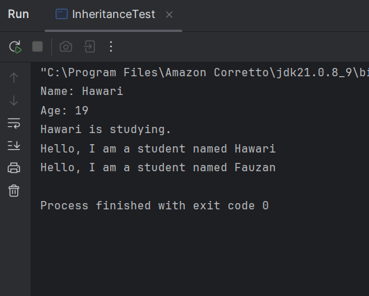

# Laporan Modul 6 : Inheritance
**Mata Kuliah:** Praktikum Pemrograman Berorientasi Objek   
**Nama:** Muhammad Hawari
**NIM:** 2024573010123  
**Kelas:** TI 2E

---
## Pendahuluan

Pemrograman berorientasi objek (Object-Oriented Programming/OOP) merupakan paradigma pemrograman yang berfokus pada konsep objek yang merepresentasikan entitas dunia nyata.
Salah satu konsep utama dalam OOP adalah Inheritance (pewarisan), yaitu kemampuan suatu kelas untuk mewarisi atribut dan method dari kelas lain.

Dengan menggunakan inheritance, pengembang dapat menciptakan hubungan hierarki antar kelas, sehingga kode dapat digunakan kembali (reusability), lebih terstruktur, dan lebih mudah dipelihara.
Inheritance juga memungkinkan pembuatan kelas baru berdasarkan kelas yang sudah ada tanpa harus menulis ulang seluruh kode, melainkan cukup menambahkan atau memodifikasi perilaku tertentu sesuai kebutuhan.

---

## Landasan Teori

### 1. Pengertian Inheritance

Dalam pemrograman berorientasi objek (Object-Oriented Programming/OOP), Inheritance atau pewarisan adalah mekanisme yang memungkinkan sebuah kelas untuk mewarisi atribut dan method dari kelas lain.
Tujuan utamanya adalah agar kode dapat digunakan kembali (code reusability) dan untuk menciptakan hubungan hierarkis antar kelas.

Dalam konsep ini:

+ Kelas induk (superclass) adalah kelas yang menyediakan atribut dan perilaku umum.
+ Kelas anak (subclass) adalah kelas yang mewarisi karakteristik tersebut, namun juga dapat memiliki atribut dan perilaku tambahan yang lebih spesifik.

Dengan kata lain, inheritance menggambarkan hubungan "is-a" (adalah-sebuah).
Misalnya, jika Dog adalah subclass dari Animal, maka hubungan tersebut bisa dijelaskan dengan kalimat “Dog is an Animal”.

---

### 2. Tujuan dan Manfaat Inheritance

Konsep inheritance memiliki beberapa manfaat utama yang sangat penting dalam desain program berbasis objek, yaitu:

1. Reusability (Penggunaan Kembali Kode)

   - Kelas anak tidak perlu menulis ulang semua atribut dan method dari kelas induk.
   Cukup mewarisi, sehingga kode menjadi lebih efisien dan mudah dikelola.

2. Extensibility (Dapat Diperluas)

   - Subclass dapat menambahkan perilaku baru atau memodifikasi method yang diwarisi dengan cara overriding.

3. Abstraction dan Generalization

   - Inheritance memungkinkan kita membuat hierarki dari objek-objek dunia nyata secara logis.
   Misalnya: Animal → Mammal → Dog.

4. Maintenance Lebih Mudah

   - Perubahan pada kelas induk otomatis berlaku untuk semua kelas anak, sehingga mengurangi duplikasi dan mempermudah pemeliharaan kode.


---

### Cara Implementasi Program

- Gunakan kata kunci `extends` untuk mewarisi dari sebuah class.
- Subclass dapat mengakses anggota (fields dan methods) yang bersifat `protected` dan `public` dari superclass.
- Subclass dapat mengoverride method dari superclass.
- Gunakan kata kunci `super` untuk mengakses anggota superclass.

---

### 3. Jenis-Jenis Inheritance
#### a. Single Inheritance (Pewarisan Tunggal)

Jenis inheritance yang paling umum digunakan.
Dalam single inheritance, satu subclass hanya mewarisi dari satu superclass.

Contoh:
```java
class Animal {
    void eat() {
        System.out.println("Hewan sedang makan...");
    }
}

class Dog extends Animal {
    void bark() {
        System.out.println("Anjing menggonggong!");
    }
}

public class Main {
    public static void main(String[] args) {
        Dog d = new Dog();
        d.eat();   // diwarisi dari Animal
        d.bark();  // milik Dog
    }
}

```
Penjelasan:

- `Dog` adalah subclass dari `Animal`.
- `Dog` mewarisi method `eat()` dari `Animal`.
- Ini adalah bentuk pewarisan paling sederhana dan paling sering digunakan.

---

#### b. Multilevel Inheritance (Pewarisan Bertingkat)

Dalam jenis ini, sebuah kelas mewarisi dari kelas lain, dan kelas tersebut juga menjadi induk bagi kelas berikutnya.
Artinya, pewarisan terjadi secara berantai.

Contoh:
```java
class Animal {
    void eat() {
        System.out.println("Hewan sedang makan...");
    }
}

class Mammal extends Animal {
    void breathe() {
        System.out.println("Mamalia bernafas dengan paru-paru.");
    }
}

class Dog extends Mammal {
    void bark() {
        System.out.println("Anjing menggonggong!");
    }
}

public class Main {
    public static void main(String[] args) {
        Dog d = new Dog();
        d.eat();     // dari Animal
        d.breathe(); // dari Mammal
        d.bark();    // dari Dog
    }
}

```
Penjelasan:

- `Dog` mewarisi dari `Mammal`, dan `Mammal` mewarisi dari `Animal`.
- Sehingga, `Dog` secara tidak langsung juga mewarisi semua atribut dan method dari `Animal`.
- Ini menggambarkan hierarki alami, seperti dalam klasifikasi makhluk hidup.

---

#### c. Hierarchical Inheritance (Pewarisan Bertingkat Lebar)

Dalam hierarchical inheritance, satu superclass diwarisi oleh beberapa subclass sekaligus.
Setiap subclass memiliki perilaku tambahan sendiri, tetapi berbagi atribut dan method umum dari superclass.

Contoh:
```java
class Animal {
    void eat() {
        System.out.println("Hewan sedang makan...");
    }
}

class Dog extends Animal {
    void bark() {
        System.out.println("Anjing menggonggong!");
    }
}

class Cat extends Animal {
    void meow() {
        System.out.println("Kucing mengeong!");
    }
}

public class Main {
    public static void main(String[] args) {
        Dog d = new Dog();
        Cat c = new Cat();
        d.eat();
        c.eat();
        d.bark();
        c.meow();
    }
}

```
Penjelasan:

- `Dog` dan `Cat` sama-sama merupakan subclass dari `Animal`.
- Mereka mewarisi perilaku umum `eat()` tetapi menambahkan perilaku spesifik masing-masing `(bark() dan meow())`.

---

#### d. Multiple Inheritance (Pewarisan Ganda – melalui Interface)

Java tidak mengizinkan multiple inheritance antar kelas, tetapi mengizinkannya melalui interface.
Hal ini untuk menghindari konflik pewarisan (misalnya dua kelas induk memiliki method dengan nama sama).

Contoh:
```java
interface Animal {
    void eat();
}

interface Pet {
    void play();
}

class Dog implements Animal, Pet {
    public void eat() {
        System.out.println("Anjing sedang makan.");
    }
    public void play() {
        System.out.println("Anjing bermain bola.");
    }
}

public class Main {
    public static void main(String[] args) {
        Dog d = new Dog();
        d.eat();
        d.play();
    }
}

```

Penjelasan:

- `Dog` mengimplementasikan dua interface: `Animal` dan `Pet`.
- Meskipun Java tidak memperbolehkan class `Dog` extends `Animal,` `Pet`,
tetapi implements dapat digunakan untuk mendapatkan perilaku ganda.
- Dengan interface, Java dapat menggunakan konsep multiple inheritance secara aman.

---

#### e. Hybrid Inheritance (Pewarisan Campuran)

Hybrid inheritance merupakan kombinasi dari beberapa jenis inheritance, misalnya penggabungan antara multilevel dan multiple inheritance.

Namun di Java, hybrid inheritance hanya bisa dilakukan melalui kombinasi kelas dan interface, bukan antar kelas murni.

Contoh:
```java
interface Animal {
    void eat();
}

class Mammal {
    void breathe() {
        System.out.println("Mamalia bernafas.");
    }
}

class Dog extends Mammal implements Animal {
    public void eat() {
        System.out.println("Anjing makan tulang.");
    }
}

public class Main {
    public static void main(String[] args) {
        Dog d = new Dog();
        d.eat();
        d.breathe();
    }
}

```

Penjelasan:

- `Dog` mewarisi dari `Mammal` (kelas induk) dan juga mengimplementasikan `Animal` (interface).
- Ini adalah bentuk kombinasi antara pewarisan tunggal dan pewarisan melalui interface.
- Contoh ini memperlihatkan bagaimana hybrid inheritance tetap bisa diterapkan di Java tanpa menimbulkan konflik.

---

### 3 Tabel Perbandingan Jenis Inheritance

| Jenis Inheritance        | Jumlah Superclass             | Dapat digunakan di Java   | Contoh Penggunaan               |
|--------------------------|-------------------------------|---------------------------|---------------------------------|
| Single Inheritance       | 1                             | iya                       | `Class B extends A`             |
| Multilevel Inheritance   | Lebih dari 1 (Bertingkat)     | iya                       | `Class C extends B extends A`   |
| Hierarchical Inheritance | 1 Superclass Banyak Superclass | iya                       | `Class Dog, Cat extends Animal` |
| Multiple Inheritance     | Lebih besar dari Superclass   | Tidak (Kecuali interface) | `Class C Implements A, B`       |
| Hybrid Inheritance       | Kombinasi Class + Interface   | ya                        | `Class C entends A, Implement B` |

---


## 2. Praktikum 1 : Memahami Single Inheritance

---

#### Tujuan
Memahami konsep dan implementasi single inheritance.

#### Langkah langkah
1. Buat sebuah package baru di dalam package `modul_6` dengan nama `praktikum_1`
2. Buat class `Person` sebagai superclass:
```java
package modul_6.praktikum_1;

public class Person {
    protected String name;
    protected int age;

    public Person(String name, int age) {
        this.name = name;
        this.age = age;
    }

    public void displayinfo() {
        System.out.println("Name: " + name);
        System.out.println("Age: " + age);
    }

    public void greet() {
        System.out.println("Hello, I am a person");
    }
}
```

3. Buat class `Student` sebagai subclass yang mewarisi `Person`:
```java
package modul_6.praktikum_1;

public class Student extends Person {
    private String studentId;

    public Student(String name, int age, String studentId) {
        super(name, age); // untuk memanggil constructor superclass
        this.studentId = studentId;
    }

    public void study() {
        System.out.println(name + " is studying.");
    }

    @Override
    public void greet() {
        System.out.println("Hello, I am a student named " + name);
    }
}
```

4. Buat class `InheritanceTest` untuk testing:
```java
package modul_6.praktikum_1;

public class InheritanceTest {
    public static void main(String[] args) {
        Student student = new Student("Hawari", 19, "2024573010123");

        //memanggul method dari superclass
        student.displayinfo();

        // memanggul method dari subclass
        student.study();

        // memanggil overriden method
        student.greet();

        // polymorphism: Student sebagai person
        Person person = new Student("Fauzan", 19, "2024573010124");
        person.greet(); // untuk memanggil method yang di-override
    }
}
```

5. Jalankan program dan amati hasilnya
6. Perhatikan bagaimana subclass mewarisi dan memperluas fungsionalitas superclass
#### Hasil :
Output :


---


##### Analisis :


---

## Praktikum 2: Getter dan Setter

---

#### Teori Dasar

---

#### Analisis


---
### Praktikum 3: Read-Only dan Write-Only Properties
---

#### Tujuan

#### Output :

---


### Analisis :

1. student.displayinfo()

- `displayinfo()` diwarisi dari `Person`, jadi akan menampilkan:
```
Name: Hawari
Age: 19
```

2. `student.study()`
- Method milik Student sendiri:
```
Hawari is studying.
```

3. `student.greet()`
- Karena di-override, maka yang dipanggil versi `Student`:
```
Hello, I am a student named Hawari
```

4. Person person =` new Student("Fauzan", 19, "2024573010124")`;

- Ini contoh runtime polymorphism, di mana tipe variabel (`Person`) tidak sama dengan tipe objek (`Student`).
- Ketika `person.greet()` dipanggil, Java akan menjalankan versi `greet()` milik `Student`, bukan `Person`.
```
Hello, I am a student named Fauzan

```

---

### Hasil Output Lengkap
Ketika dijalankan, output di terminal akan seperti ini:
```
Name: Hawari
Age: 19
Hawari is studying.
Hello, I am a student named Hawari
Hello, I am a student named Fauzan

```

---

### Kesimpulan

Program ini memperlihatkan Single Inheritance di mana:

Student mewarisi atribut dan perilaku dari Person.

Dapat memperluas fungsionalitas dengan menambah method baru (study()).

Dapat mengganti perilaku yang ada dengan overriding (greet()).

Menunjukkan polymorphism — satu referensi (Person) dapat menunjuk ke berbagai objek turunan (Student) dan tetap memanggil method yang sesuai dengan tipe objek sebenarnya pada runtime.


---

## Praktikum 2: Method Overriding dan Kata Kunci super

---

#### Teori Dasar
Method overriding memungkinkan subclass memberikan implementasi spesifik untuk method yang sudah didefinisikan di superclass. Kata kunci super digunakan untuk mengakses anggota superclass.

#### Aturan Method Overriding:
1. Method harus memiliki nama dan parameter yang sama
2. Return type harus sama atau subtype (covariant return type)
3. Access modifier tidak boleh lebih restriktif
4. Tidak bisa override method yang final atau static


Penggunaan super:

1. `super()` - Memanggil constructor superclass
2. `super.methodName()` - Memanggil method superclass
3. `super.variableName` - Mengakses variable superclass


#### Tujuan:
Memahami cara melakukan method overriding dan penggunaan kata kunci `super`.


#### Langkah-langkah:
1. Buat sebuah package baru di dalam package `modul_6` dengan nama `praktikum_2`
2. Buat class `Vehicle` sebagai `superclass`:
```java
package modul_6.praktikum_2;

public class Vehicle {
    protected String brand;
    protected int speed;

    public Vehicle(String brand, int speed) {
        this.brand = brand;
        this.speed = speed;
    }

    public void start() {
        System.out.println("Vehicle is starting");
    }

    public void displayInfo() {
        System.out.println("Brand: " + brand);
        System.out.println("Speed: " + speed + " km/h");
    }
}
```

---

3. Buat class `Car` sebagai subclass yang mewarisi `Vehicle`:
```java
package modul_6.praktikum_2;

public class Car extends Vehicle {
    private  int numberOfDoors;

    public Car(String brand, int speed, int numberOfDoors) {
        super(brand, speed);
        this.numberOfDoors = numberOfDoors;
    }

    @Override
    public void start() {
        super.start();
        System.out.println("Car engine is running smoothly");
    }

    @Override
    public void displayInfo() {
        super.displayInfo(); // untuk memanggil methode displayInfo dari superclass
        System.out.println("Number of Doors: " + numberOfDoors);
    }

    public void honk () {
        System.out.println("Beep beep!");
    }
}
```

---

4. Buat class `OverrideTest` untuk testing:
```java
package modul_6.praktikum_2;

public class Overridetest {
    public static void main(String[] args) {
        Car car = new Car("Toyota", 277, 2);

        // memanggil overriden method
        car.start();
        car.displayInfo();
        car.honk();

        // Demonstrasi polymorphism
        Vehicle vehicle = new Car("Pagani", 320, 2);
        vehicle.start(); // memanggil method yang di-override
        vehicle.displayInfo(); // memanggil method yang di override
    }
}
```

5. Jalankan program dan amati:
- Cara method overriding bekerja
- Penggunaan kata kunci super untuk mengakses superclass
- Konsep polymorphism dalam inheritance

---

### Analisis
#### Cara Kerja Method Overriding
Method overriding adalah proses ketika sebuah subclass mendefinisikan kembali method yang sudah ada di superclass dengan nama, tipe kembalian, dan parameter yang sama.
Tujuan utamanya adalah untuk mengubah perilaku method superclass agar sesuai dengan kebutuhan subclass.

Dalam program ini, dua method dari `Vehicle` di-override di dalam `Car`:
```java
@Override
public void start() {
    super.start(); // memanggil method start() dari Vehicle
    System.out.println("Car engine is running smoothly");
}

@Override
public void displayInfo() {
    super.displayInfo(); // memanggil displayInfo() dari Vehicle
    System.out.println("Number of Doors: " + numberOfDoors);
}
```

#### Penjelasan mekanismenya:

- Saat objek `Car` memanggil `start()` atau `displayInfo()`, yang dieksekusi adalah versi method milik `Car`, bukan milik `Vehicle`.
- Namun karena di dalam method override tersebut masih ada pemanggilan `super.start()` dan `super.displayInfo()`, maka kode dari superclass tetap dijalankan terlebih dahulu sebelum tambahan perilaku dari subclass dijalankan.

---

#### Penggunaan Keyword super

Kata kunci `super` `digunakan untuk mengakses anggota (atribut atau method) dari superclass yang tertutupi oleh subclass.
Dalam konteks program ini, super digunakan dalam dua tempat berbeda:

a. pada constructor
```java
public Car(String brand, int speed, int numberOfDoors) {
    super(brand, speed);
    this.numberOfDoors = numberOfDoors;
}
```
Pemanggilan `super`(`brand`, `speed`) berfungsi untuk memanggil constructor dari superclass (`Vehicle`) agar atribut `brand` dan `speed` dapat diinisialisasi sebelum atribut baru `numberOfDoors` diatur.

b. Pada Method
```java
super.start();
super.displayInfo();
```

`super.start()` dan `super.displayInfo()` digunakan untuk menjalankan perilaku asli dari superclass `(Vehicle)` sebelum subclass menambahkan perilaku tambahan miliknya.
Dengan demikian, subclass tetap mempertahankan fungsi dasar dari superclass namun memperkaya perilakunya sesuai konteks subclass.

---

#### Kesimpulan:
Keyword super menjadi jembatan bagi subclass untuk tetap menggunakan fitur dari superclass tanpa harus menulis ulang kode yang sama (code reusability).

---

### Konsep Polymorphism dalam Inheritance
Polymorphism berarti “banyak bentuk”, yaitu kemampuan sebuah referensi dari superclass untuk menunjuk ke objek subclass yang berbeda dan menyesuaikan perilakunya secara dinamis.

Contohnya pada program:
```java
Vehicle vehicle = new Car("Pagani", 320, 2);
vehicle.start();
vehicle.displayInfo();
```

Penjelasan:

- Variabel `vehicle` bertipe `Vehicle`, tetapi objek sebenarnya yang diinisialisasi adalah `Car`.
- Ketika `vehicle.start()` dipanggil, Java tidak menjalankan method `start()` dari `Vehicle`, melainkan dari `Car`, karena objek yang sebenarnya adalah `Car`.
- Hal ini disebut runtime polymorphism, di mana keputusan method mana yang akan dijalankan dilakukan pada saat program berjalan (runtime), bukan saat dikompilasi.

Kesimpulan:

Polymorphism memungkinkan penggunaan tipe referensi yang sama (Vehicle) untuk objek yang berbeda (Car), memberikan fleksibilitas dan efisiensi dalam desain program berbasis OOP.

---

### Alur Eksekusi Program
Ketika program dijalankan, output yang muncul adalah:
```
Vehicle is starting
Car engine is running smoothly
Brand: Toyota
Speed: 277 km/h
Number of Doors: 2
Beep beep!
Vehicle is starting
Car engine is running smoothly
Brand: Pagani
Speed: 320 km/h
Number of Doors: 2
```

Penjelasan alurnya:

1. Objek car (tipe Car) memanggil:
   - `start()` → menjalankan method override di `Car`
   - `displayInfo()` → menjalankan versi yang diubah di `Car`
   - `honk()` → method khusus milik `Car`
2. Objek `vehicle` (tipe `Vehicle` tapi berisi objek `Car`) menunjukkan polymorphism:
   - Walau tipe referensi` Vehicle`, method `start()` dan `displayInfo()` tetap menjalankan versi milik `Car`.

---
Kesimpulan 

Berdasarkan hasil percobaan dan pengamatan, dapat disimpulkan bahwa:

1. Method Overriding memungkinkan subclass (Car) untuk mengganti perilaku method yang diwarisi dari superclass (Vehicle) agar lebih spesifik dengan tetap mempertahankan struktur dasarnya.
2. Keyword super digunakan untuk:
   - Memanggil constructor dari superclass.
   - Mengakses method atau atribut dari superclass yang sudah di-override.
3. Polymorphism memungkinkan satu referensi (Vehicle) untuk menunjuk ke berbagai objek subclass (Car), dan perilaku method yang dijalankan akan menyesuaikan dengan tipe objek yang sebenarnya saat runtime.

Dengan penerapan ketiga konsep ini, program menjadi:

- Lebih fleksibel, karena perilaku objek dapat berubah sesuai jenis subclass-nya.
- Lebih efisien dan mudah diperluas, karena tidak perlu menulis ulang kode dasar yang sama pada setiap kelas turunan.

---

## Praktikum 3: Multilevel dan Hierarchical Inheritance

---

#### Tujuan:
Memahami konsep multilevel dan hierarchical inheritance.

#### Langkah-langkah:
1. Buat sebuah package baru di dalam package `modul_6` dengan nama `praktikum_3`
2. Buat class` Animal` sebagai superclass:
```java
package modul_6.praktikum_3;

public class Animal {
    protected String name;

    public Animal(String name) {
        this.name = name;
    }

    public void eat() {
        System.out.println(name + " is eating.");
    }

    public void sleep() {
        System.out.println(name + " is sleeping.");
    }
}
```

3. Buat class `Mammal` yang mewarisi `Animal` (multilevel inheritance):
```java
package modul_6.praktikum_3;

public class Mammal extends Animal {
    protected String furColor;

    public Mammal(String name, String furColor) {
        super(name);
        this.furColor = furColor;
    }

    public void giveBirth(){
        System.out.println(name + " is giving birth to live young.");
    }
}
```

4. Buat class `Dog` yang mewarisi `Mammal` (multilevel inheritance):

```java
package modul_6.praktikum_3;

public class Dog extends Mammal {
    private String breed;

    public Dog(String name, String furColor, String breed) {
        super(name, furColor);
        this.breed = breed;
    }

    public void bark() {
        System.out.println(name + " is Barking: woof woof!");
    }

    @Override
    public void eat() {
        System.out.println(name + " the dog is eating dog food.");
    }
}
```

5. Buat class `Cat` yang mewarisi `Mammal` (hierarchical inheritance):
```java
package modul_6.praktikum_3;

public class Cat extends Mammal {
    private boolean isIndoor;

    public Cat(String name, String furColor, boolean isIndoor) {
        super(name, furColor);
        this.isIndoor = isIndoor;
    }

    public void meow() {
        System.out.println(name + " is meowing: Meow Meow!");
    }

    @Override
    public void eat() {
        System.out.println(name + " the cat is eating cat food.");
    }
}
```

6. Buat class `InheritanceTypeTest` untuk testing:
```java
package modul_6.praktikum_3;

public class InheritanceTypeTest {
    public static void main(String[] args) {
        // Multivelev inheritance test
        Dog dog = new Dog("Buddy", "Brown", "Golden Retriever");
        dog.eat(); // dari Animal, di-override di Dog
        dog.sleep(); // dari Animal
        dog.giveBirth(); // dari Mammal
        dog.bark(); // dari Dog

        System.out.println();

        //hierarchical inheritance test
        Cat cat = new Cat("Whiskers", "White", true);
        cat.eat(); // dari Animal, di override di Cat
        cat.sleep();
        cat.giveBirth();
        cat.meow();

        System.out.println();

        //Polymorphism dengan hierarchical inheritance
        Animal[] animals = {new Dog("Max", "Black", "Labrador"),
                            new Cat("Luna", "Gray", false)};

        for (Animal animal : animals) {
            animal.eat(); // akan memanggil method yang sesuai dengan objek sebenarnya
        }
    }
}

```

7. Jalankan program dan amati:
   - Cara multilevel inheritance membentuk rantai pewarisan.
   - Cara hierarchical inheritance memungkinkan multiple class mewarisi dari satu superclass.
   - Polymorphism bekerja dengan inheritance hierarchy.

---

### Analisis Program Praktikum 3

1. Cara Multilevel Inheritance Membentuk Rantai Pewarisan
   Konsep:

   Multilevel inheritance berarti suatu kelas mewarisi kelas lain, dan kelas tersebut juga diwarisi oleh kelas berikutnya.
   Dengan kata lain, pewarisan terjadi secara berantai (lebih dari satu tingkat).
   
Rantai pewarisan pada program ini:

    Animal  →  Mammal  →  Dog

Penjelasan:

- `Animal` adalah superclass utama, berisi atribut dan perilaku umum semua hewan `(eat() dan sleep())`.
- `Mammal` mewarisi `Animal`, sehingga mendapatkan semua method` eat()` dan `sleep()`, lalu menambahkan method baru `giveBirth()` dan atribut `furColor`.
- `Dog` mewarisi `Mammal`, otomatis mendapat seluruh sifat dan method dari `Animal` dan `Mammal`, lalu menambah method baru `bark()` serta meng-override method `eat()`.

Ilustrasi saat objek `Dog` dibuat:
```
Dog dog = new Dog("Buddy", "Brown", "Golden Retriever");
```

- Java pertama menjalankan constructor` Dog`.
- `Dog` memanggil constructor `Mammal` melalui super(`name`, `furColor`).

- Constructor `Mammal` memanggil constructor `Animal` melalui super(`name`).
Terjadi rantai pewarisan tiga tingkat, dari `Animal` → `Mammal` → `Dog`.
Semua fitur `Animal` dan` Mammal` bisa digunakan oleh `Dog`.

---

#### Kesimpulan:
Multilevel inheritance membentuk rantai pewarisan bertingkat, di mana subclass terakhir (Dog) mewarisi seluruh perilaku dan atribut dari kelas di atasnya (Mammal dan Animal), sehingga menciptakan hubungan hierarki yang berlapis dan reusable.


---

Cara Hierarchical Inheritance Memungkinkan Multiple Class Mewarisi dari Satu Superclass

Konsep:
Hierarchical inheritance terjadi ketika beberapa subclass mewarisi dari satu superclass yang sama.

Contoh pada program:
```
          Animal
             ↓
          Mammal
          ↙    ↘
        Dog     Cat

```

Penjelasan:

- `Mammal` berperan sebagai superclass tunggal yang diturunkan ke dua subclass berbeda: `Dog` dan `Cat`.
- Kedua kelas ini memiliki struktur dasar yang sama (mewarisi `name`, `furColor`, `eat()`, `sleep()`, `giveBirth()`), tetapi memiliki perilaku spesifik masing-masing:
  - `Dog` menambahkan `bark()` dan meng-override `eat()` agar cocok dengan perilaku anjing.
  - `Cat` menambahkan `meow()` dan juga meng-override `eat()` agar sesuai dengan perilaku kucing.


#### Manfaat hierarchical inheritance:

- Reusability — method umum tidak perlu ditulis ulang di setiap subclass.
- Organisasi kode lebih jelas — perilaku umum disimpan di superclass, perilaku unik di subclass.
- Kemudahan pengembangan — menambah subclass baru (misalnya `Elephant`) tidak perlu mengubah kelas lain, cukup warisi Mammal.

Kesimpulan:

Hierarchical inheritance memungkinkan beberapa subclass memiliki dasar yang sama dari satu superclass, namun tetap bisa menambahkan atau memodifikasi perilaku sesuai kebutuhan masing-masing.

---

### Polymorphism Bekerja dengan Inheritance Hierarchy

Konsep:

Polymorphism (khususnya runtime polymorphism) memungkinkan objek subclass diperlakukan sebagai objek superclass, tetapi tetap menjalankan perilaku sesuai kelas aslinya.

Implementasi pada program:
```java
Animal[] animals = {
    new Dog("Max", "Black", "Labrador"),
    new Cat("Luna", "Gray", false)
};

for (Animal animal : animals) {
    animal.eat(); // Method dipilih berdasarkan tipe objek sebenarnya
}
```

Penjelasan:

- `animals` adalah array bertipe Animal, tetapi isinya adalah objek `Dog` dan `Cat`.
- Saat `animal.eat()` dipanggil, Java secara dinamis memeriksa tipe objek sebenarnya:
  - Jika `animal` adalah `Dog`, maka method `Dog.eat()` yang dipanggil.
  - Jika `animal` adalah `Cat`, maka method `Cat.eat()` yang dipanggil.

Inilah yang disebut Dynamic Method Dispatch — pemilihan method berdasarkan tipe objek saat runtime, bukan tipe referensinya.

Manfaat polymorphism:

- Kode menjadi lebih fleksibel dan mudah diperluas.
- Program dapat bekerja dengan objek berbeda tanpa perlu tahu kelas spesifiknya.
- Dukung prinsip Open-Closed Principle (terbuka untuk ekstensi, tertutup untuk modifikasi).


#### Kesimpulan:

Polymorphism dalam inheritance hierarchy memungkinkan satu referensi superclass (Animal) menangani banyak jenis objek (Dog, Cat, dan subclass lain) secara dinamis, menjalankan perilaku yang sesuai dengan objek aslinya.

---

## Praktikum 4: Sistem Manajemen Perpustakaan Sederhana

---

#### Tujuan:
Menerapkan konsep inheritance dalam project real-world sederhana untuk mengelola sistem perpustakaan.

#### Deskripsi Project:
Kita akan membuat sistem manajemen perpustakaan sederhana yang memiliki berbagai jenis item (buku, majalah, DVD) dengan karakteristik yang berbeda namun memiliki beberapa kesamaan.

#### Langkah-langkah:
1. Buat sebuah package baru di dalam package `modul_6` dengan nama `praktikum_4`
2. Buat class `LibraryItem` sebagai superclass:
```java
package modul_6.praktikum_4;

public abstract class LibraryItem {
    protected String itemId;
    protected String title;
    protected int year;
    protected boolean isAvailable;

    public LibraryItem(String itemId, String title, int year) {
        this.itemId = itemId;
        this.title = title;
        this.year = year;
        this.isAvailable = true;
    }

    // getter methods
    public String getItemId() { return itemId; }
    public String getTitle() { return title; }
    public int getYear() { return year; }
    public boolean isAvailable() { return isAvailable; }


    // getter methods
    public void  setAvailable(boolean isAvailable) { isAvailable = isAvailable; }

    // Abstract method yang harus diimplementasikan subclass
    public abstract void displayInfo();

    // Concrete method yang bisa digunakan semua subclass
    public void borrowItem() {
        if  (isAvailable) {
            isAvailable = false;
            System.out.println(title + " behasil dipinjam");
        } else {
            System.out.println(title + " sedang tidak tersedia");
        }
    }

    public void returnItem() {
        isAvailable = true;
        System.out.println(title + " behasil dikembalikan");
    }
}
```

3. Buat class `Book` yang mewarisi `LibraryItem`:
```java
package modul_6.praktikum_4;

public class Book extends LibraryItem {
    private String author;
    private String isbn;
    private int numberOpPages;

    public Book(String itemId,String title, int year, String author, String isbn, int numberOpPages) {
        super(itemId, title, year);
        this.author = author;
        this.isbn = isbn;
        this.numberOpPages = numberOpPages;
    }

    @Override
    public void displayInfo() {
        System.out.println("BUKU");
        System.out.println("-----------------------");
        System.out.println("ID : " + itemId);
        System.out.println("Judul: " + title);
        System.out.println("Penulis : " + author);
        System.out.println("ISBN : " + isbn);
        System.out.println("Jumlah Halaman: " + numberOpPages);
        System.out.println("Status: " + (isAvailable ? "Tersedia" : "Dipinjam"));
        System.out.println("-----------------------");
    }

    // methods khusus Book
    public void readSample() {
        System.out.println("Membaca sample dari buku: " + title);
    }
}
```

4. Buat class `Magazine` yang mewarisi `LibraryItem`:
```java
package modul_6.praktikum_4;

public class Magazine extends LibraryItem {
    private String publisher;
    private int issueNumber;
    private String category;

    public Magazine(String itemId, String title, int year, String publisher, int issueNumber, String category) {
        super(itemId, title, year);
        this.publisher = publisher;
        this.issueNumber = issueNumber;
        this.category = category;
    }

    @Override
    public void displayInfo() {
        System.out.println("-------- MAJALAH --------");
        System.out.println("ID: " + itemId);
        System.out.println("Title: " + title);
        System.out.println("publisher: " + publisher);
        System.out.println("Year: " + year);
        System.out.println("Edisi: " + issueNumber);
        System.out.println("Category: " + category);
        System.out.println("status: " + (isAvailable ? "Tersedia" : "Dipinjam"));
        System.out.println("------------------------");
    }

    // method khusus untuk magazin
    public void browseArticles() {
        System.out.println("Menelusuri artikel dalam majalah: " + title);
    }
}
```

5. Buat class `DVD` yang mewarisi `LibraryItem`:
```java
package modul_6.praktikum_4;

public class DVD extends LibraryItem {
    private String director;
    private int duration;
    private String genre;

    public DVD(String itemId, String title, int year, String director, int duration, String genre) {
        super(itemId, title, year);
        this.director = director;
        this.duration = duration;
        this.genre = genre;
    }

    @Override
    public void displayInfo() {
        System.out.println("----- DVD -----");
        System.out.println("ID: " + itemId);
        System.out.println("Judul: " + title);
        System.out.println("Sutradara: " + director);
        System.out.println("Durasi: " + duration + " Menit");
        System.out.println("Genre: " + genre);
        System.out.println("status: " + (isAvailable ? "Tersedia" : "Dipinjam"));
        System.out.println("----------------------");
    }

    // method khusus untuk DVD
    public void playtrailer() {
        System.out.println("Memutar trailer DVD: " + title);
    }
}
```

6. Buat class LibraryManagementSystem sebagai main class:
```java
package modul_6.praktikum_4;

import java.util.ArrayList;
import java.util.Scanner;

public class LibraryManagementSystem {
    private static ArrayList<LibraryItem> libraryItems = new ArrayList<>();
    private static Scanner scanner = new Scanner(System.in);

    public static void main(String[] args) {
        initializeSampleData();

        while (true) {
            displayMenu();
            int choice = scanner.nextInt();
            scanner.nextLine(); // consume newline

            switch (choice) {
                case 1:
                    displayAllItems();
                    break;
                case 2:
                    borrowItem();
                    break;
                case 3:
                    returnItem();
                    break;
                case 4:
                    addNewItem();
                    break;
                case 5:
                    searchItem();
                    break;
                case 6:
                    System.out.println("Terima kasih telah menggunakan sistem perpustakaan!");
                    return;
                default:
                    System.out.println("Pilihan tidak valid!");
            }
        }
    }

    private static void displayMenu() {
        System.out.println("\n---- SISTEM MANAJEMEN PERPUSTAKAAN ----");
        System.out.println("1. Tampilkan Semua Item");
        System.out.println("2. Pinjam Item");
        System.out.println("3. Kembalikan Item");
        System.out.println("4. Tambah Item Baru");
        System.out.println("5. Cari Item");
        System.out.println("6. Keluar");
        System.out.print("Pilih menu: ");
    }

    private static void initializeSampleData() {
        // Tambahkan sample data
        libraryItems.add(new Book("B001", "Pemrograman Java", 2023, "Budi Santoso", "978-1234567890", 350));
        libraryItems.add(new Book("B002", "Struktur Data", 2022, "Sari Dewi", "978-0987654321", 280));
        libraryItems.add(new Magazine("M001", "National Geographic", 2024, "NG Media", 245, "Sains"));
        libraryItems.add(new DVD("D001", "The Java Documentary", 2023, "John Programmer", 120, "Edukasi"));
    }

    private static void displayAllItems() {
        System.out.println("\n---- DAFTAR SEMUA ITEM PERPUSTAKAAN ----");
        for (LibraryItem item : libraryItems) {
            item.displayInfo();
            System.out.println();
        }
    }

    private static void borrowItem() {
        System.out.print("Masukkan ID item yang ingin dipinjam: ");
        String itemId = scanner.nextLine();

        for (LibraryItem item : libraryItems) {
            if (item.getItemId().equalsIgnoreCase(itemId)) {
                item.borrowItem();
                return;
            }
        }
        System.out.println("Item dengan ID " + itemId + " tidak ditemukan!");
    }

    private static void returnItem() {
        System.out.print("Masukkan ID item yang ingin dikembalikan: ");
        String itemId = scanner.nextLine();

        for (LibraryItem item : libraryItems) {
            if (item.getItemId().equalsIgnoreCase(itemId)) {
                item.returnItem();
                return;
            }
        }
        System.out.println("Item dengan ID " + itemId + " tidak ditemukan!");
    }

    private static void addNewItem() {
        System.out.println("\n---- TAMBAH ITEM BARU ----");
        System.out.println("1. Buku");
        System.out.println("2. Majalah");
        System.out.println("3. DVD");
        System.out.print("Pilih jenis item: ");
        int type = scanner.nextInt();
        scanner.nextLine();

        System.out.print("ID Item: ");
        String itemId = scanner.nextLine();
        System.out.print("Judul: ");
        String title = scanner.nextLine();
        System.out.print("Tahun: ");
        int year = scanner.nextInt();
        scanner.nextLine();

        switch (type) {
            case 1:
                System.out.print("Penulis: ");
                String author = scanner.nextLine();
                System.out.print("ISBN: ");
                String isbn = scanner.nextLine();
                System.out.print("Jumlah Halaman: ");
                int pages = scanner.nextInt();
                libraryItems.add(new Book(itemId, title, year, author, isbn, pages));
                break;
            case 2:
                System.out.print("Penerbit: ");
                String publisher = scanner.nextLine();
                System.out.print("Edisi: ");
                int issue = scanner.nextInt();
                scanner.nextLine();
                System.out.print("Kategori: ");
                String category = scanner.nextLine();
                libraryItems.add(new Magazine(itemId, title, year, publisher, issue, category));
                break;
            case 3:
                System.out.print("Sutradara: ");
                String director = scanner.nextLine();
                System.out.print("Durasi (menit): ");
                int duration = scanner.nextInt();
                scanner.nextLine();
                System.out.print("Genre: ");
                String genre = scanner.nextLine();
                libraryItems.add(new DVD(itemId, title, year, director, duration, genre));
                break;
            default:
                System.out.println("Jenis item tidak valid!");
                return;
        }

        System.out.println("Item berhasil ditambahkan!");
    }

    private static void searchItem() {
        System.out.print("Masukkan kata kunci pencarian (judul/penulis): ");
        String keyword = scanner.nextLine().toLowerCase();

        System.out.println("\n---- HASIL PENCARIAN ----");
        boolean found = false;

        for (LibraryItem item : libraryItems) {
            if (item.getTitle().toLowerCase().contains(keyword)) {
                item.displayInfo();
                System.out.println();
                found = true;
            }
        }

        if (!found) {
            System.out.println("Tidak ada item yang sesuai dengan pencarian.");
        }
    }
}
```

7. Jalankan program dan uji semua fitur:
   - Menampilkan semua item
   - Meminjam dan mengembalikan item
   - Menambah item baru
   - Mencari item berdasarkan kata kunci

---

Output :


---

### Analisis :

#### Analisis Konsep OOP yang Diterapkan

1. Inheritance (Pewarisan)

Semua jenis item (`Book`,` Magazine`, `DVD`) mewarisi dari superclass `LibraryItem`.
```java
public abstract class LibraryItem { ... }
public class Book extends LibraryItem { ... }
public class Magazine extends LibraryItem { ... }
public class DVD extends LibraryItem { ... }
```

Artinya, ketiga subclass otomatis memiliki:

- Atribut umum (`itemId`, `title`, `year`, `isAvailable`)
- Method umum (`borrowItem()`, `returnItem()`, `getter/setter`)

#### Tujuan inheritance di sini:
Menghindari duplikasi kode. Semua properti dan perilaku umum disatukan dalam LibraryItem.

---

#### Abstraction (Abstraksi)

Superclass LibraryItem bersifat abstract, sehingga tidak bisa diinstansiasi langsung.
```java
public abstract class LibraryItem {
    public abstract void displayInfo();
}
```
`displayInfo()` adalah abstract method, yang wajib diimplementasikan oleh setiap subclass dengan cara berbeda sesuai jenis item.

Ini memaksa setiap subclass memberikan cara menampilkan informasinya sendiri:

- `Book` → menampilkan penulis, ISBN, halaman
- `Magazine` → menampilkan edisi, penerbit, kategori
- `DVD` → menampilkan sutradara, durasi, genre

---

#### Polymorphism (Polimorfisme)

Polimorfisme terjadi karena daftar item disimpan dalam bentuk:
```java
ArrayList<LibraryItem> libraryItems = new ArrayList<>();
```

Namun, daftar ini berisi objek dari berbagai subclass:
```java
libraryItems.add(new Book(...));
libraryItems.add(new Magazine(...));
libraryItems.add(new DVD(...));
```

Saat dijalankan :
```java
for (LibraryItem item : libraryItems) {
    item.displayInfo();
}
```

Metode `displayInfo()` yang dipanggil akan menyesuaikan tipe objeknya (`Book/Magazine/DVD`).
Inilah runtime polymorphism melalui method overriding.

---

#### Encapsulation (Enkapsulasi)

Setiap atribut bersifat protected atau private, dan diakses melalui getter/setter.
Contohnya:
```java
public String getItemId() { return itemId; }
public boolean isAvailable() { return isAvailable; }
```
Namun ada bug kecil di setter:
```java
public void setAvailable(boolean isAvailable) { isAvailable = isAvailable; }
```

Ini tidak berfungsi karena variabel parameter menimpa nama atribut.

Harusnya:
```java
public void setAvailable(boolean isAvailable) {
    this.isAvailable = isAvailable;
}
```

---

#### Analisis Fungsi dalam LibraryManagementSystem
1. initializeSampleData()

Menambahkan data contoh:

- 2 Buku
- 1 Majalah
- 1 DVD

Fungsi ini memastikan sistem punya data awal untuk diuji tanpa input manual.

---

2. displayAllItems()

Menampilkan semua item dengan memanfaatkan polimorfisme.
```java
for (LibraryItem item : libraryItems) {
    item.displayInfo();
}
```

Tiap objek menampilkan format berbeda (Book, Magazine, DVD).

---

3. borrowItem() dan returnItem()

Keduanya mencari item berdasarkan `itemId`, lalu memanggil method umum:
```java
item.borrowItem();
item.returnItem();
```
#### Logika:

- Jika item tersedia → dipinjam, ubah isAvailable ke false
- Jika sedang dipinjam → tampilkan pesan “sedang tidak tersedia”
- Saat dikembalikan → status dikembalikan ke true

---

4. addNewItem()

Fitur untuk menambahkan item baru secara dinamis dari input pengguna.

Program meminta pengguna memilih jenis item:
```java
1. Buku
2. Majalah
3. DVD
```

Kemudian menambahkan objek baru sesuai tipe yang dipilih ke` ArrayList`.

Ini contoh dynamic object creation dengan inheritance.

---

5. searchItem()

Mencari item berdasarkan kata kunci (judul atau penulis).
```java
if (item.getTitle().toLowerCase().contains(keyword))
```

- Kelebihan: pencarian fleksibel (case-insensitive)
- Kelemahan: hanya mencari berdasarkan title, belum mencakup atribut lain seperti author atau publisher.

---

#### Alur Program (Flow)

1. Program dimulai → data contoh dimuat
2. Menu utama ditampilkan
3. Pengguna memilih opsi:

- (1) Lihat semua item
- (2) Pinjam item
- (3) Kembalikan item
- (4) Tambah item baru
- (5) Cari item
- (6) Keluar

4. Tiap menu memanggil metode tertentu yang bekerja dengan objek dalam ArrayList<LibraryItem>
5. Program terus berjalan hingga pengguna memilih keluar.

---

#### Kelebihan Program

- Struktur OOP rapi (Inheritance, Polymorphism, Abstraction, Encapsulation)
- Modular: tiap class punya tanggung jawab spesifik
- Mudah diperluas (bisa tambah Ebook, Newspaper, dsb.)
- Menu interaktif berbasis console
- Ada data contoh bawaan (tidak kosong saat pertama dijalankan)

---

#### Kesimpulan Analisis

Praktikum ini adalah contoh implementasi nyata dari inheritance dan polymorphism dalam konteks dunia nyata (perpustakaan).
Setiap jenis item (Book, Magazine, DVD) berbeda, namun dapat diperlakukan sama melalui superclass LibraryItem.

Sistem ini menunjukkan kekuatan desain berbasis objek (OOP) — di mana kode menjadi lebih mudah diperluas, modular, dan terstruktur.

---

### Kesimpulan 

Class Product dan ProductTest secara rinci menunjukkan bagaimana enkapsulasi:

- Menyembunyikan data penting (adminPin, productId, createdAt).
- Mengontrol perubahan nilai lewat setter dengan validasi.
- Mencegah akses langsung terhadap variabel internal.
- Meningkatkan keamanan, keandalan, dan fleksibilitas program.


----

### Referensi

#### Oracle Java Documentation – Inheritance & Polymorphism:
https://docs.oracle.com/javase/tutorial/java/IandI/index.html

→ Referensi resmi Oracle tentang Interfaces and Inheritance yang menjadi dasar struktur LibraryItem dan subclass-nya.

#### GeeksforGeeks – Inheritance in Java:
https://www.geeksforgeeks.org/inheritance-in-java/

→ Contoh implementasi pewarisan di Java dengan analogi real-world, mirip dengan hubungan Book → LibraryItem.

#### W3Schools – Java OOP Concepts:
https://www.w3schools.com/java/java_oop.asp

→ Penjelasan singkat dan mudah dipahami tentang encapsulation, inheritance, polymorphism, dan abstraction dalam Java.

#### TutorialsPoint – Abstract Classes in Java:
https://www.tutorialspoint.com/java/java_abstraction.htm

→ Membahas penggunaan abstract class dan abstract method seperti yang diterapkan pada LibraryItem.

#### GeeksforGeeks – Library Management System (Java OOP Project Example):
https://www.geeksforgeeks.org/library-management-system-project-in-java/

→ Contoh proyek sederhana manajemen perpustakaan berbasis OOP yang serupa dengan praktikum ini.