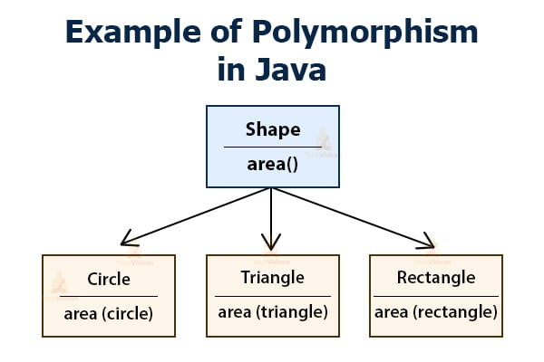
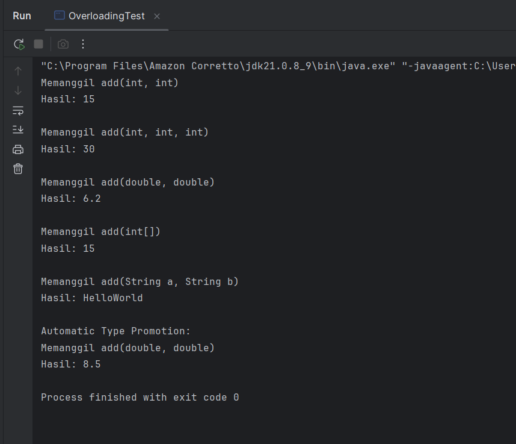
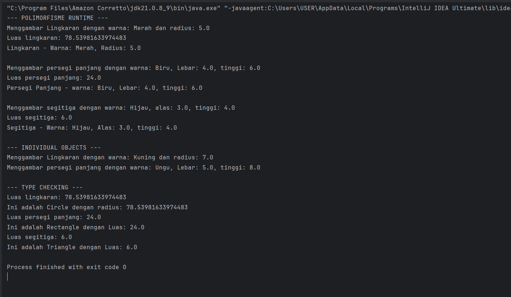

# Laporan Modul 7 : Polymorphism
**Mata Kuliah:** Praktikum Pemrograman Berorientasi Objek   
**Nama:** Muhammad Hawari
**NIM:** 2024573010123  
**Kelas:** TI 2E

---

## Pendahuluan
Dalam dunia pemrograman berorientasi objek (Object-Oriented Programming / OOP), terdapat empat pilar utama yang menjadi fondasi konsepnya, yaitu:

1. Encapsulation (Enkapsulasi)

2. Inheritance (Pewarisan)

3. Polymorphism (Polimorfisme)

4. Abstraction (Abstraksi)

Dari keempat konsep tersebut, Polymorphism memegang peran penting dalam menciptakan kode yang fleksibel, efisien, dan mudah diperluas.
Istilah polymorphism berasal dari bahasa Yunani:

- Poly berarti banyak,

- Morphe berarti bentuk.

Sehingga secara harfiah berarti “banyak bentuk”.
Dalam konteks OOP, Polymorphism berarti kemampuan objek yang sama untuk menampilkan perilaku yang berbeda tergantung dari kelas atau konteks tempat ia digunakan.

---

Polymorphism adalah konsep pemrograman yang berorientasi pada objek yang mengacu pada kemampuan variabel, fungsi atau objek untuk mengambil beberapa bentuk. Polymorphism adalah penggunaan salah satu item seperti fungsi, atribut, atau interface pada berbagai jenis objek yang berbeda dalam bahasa pemrograman. Dalam bahasa pemrograman yang menunjukkan polimorfisme, objek kelas miliki hierarki yang sama yang diwariskan dari kelas induk yang sama, mungkin memiliki fungsi dengan nama yang sama, tetapi dengan perilaku berbeda.



---

### Tujuan Polymorphism
Polymorphism dalam Java memiliki sejumlah tujuan penting yang menjadikannya salah satu pilar utama dalam paradigma Object-Oriented Programming (OOP).
Tujuan-tujuan ini berfokus pada peningkatan fleksibilitas, efisiensi, dan kemudahan pengelolaan kode dalam sistem perangkat lunak berskala kecil maupun besar.

---
#### 1. Flexibility (Fleksibilitas)

Polymorphism memungkinkan program untuk menjadi lebih fleksibel dalam berinteraksi dengan berbagai tipe objek yang berbeda melalui satu antarmuka umum.

Dalam Java, kita bisa menggunakan referensi dari superclass atau interface untuk menyimpan objek subclass. Dengan cara ini, kode dapat menangani berbagai jenis objek tanpa mengetahui detail implementasinya secara spesifik.

```java
Hewan hewan = new Kucing();
hewan.suara(); // memanggil suara() versi Kucing

```
Meskipun variabel hewan bertipe Hewan, ia dapat berperilaku seperti Kucing atau bahkan Anjing tanpa perlu diubah kodenya.
Hal ini membuat sistem menjadi lebih adaptif terhadap perubahan dan mudah diperluas tanpa harus menulis ulang logika yang sudah ada.

---
#### 2. Code Reusability (Pemakaian Ulang Kode)

Dengan polymorphism, kamu dapat menggunakan kembali kode yang sama untuk berbagai tipe objek yang berbeda.

Alih-alih menulis banyak blok kode dengan logika serupa untuk setiap tipe objek, kamu hanya perlu menulis satu implementasi umum yang bisa digunakan oleh semua subclass yang terkait.
Contoh :
```java
public void cetakSuara(Hewan h) {
    h.suara();
}
```

Metode `cetakSuara()` bisa digunakan untuk objek Kucing, Anjing, Burung, dan sebagainya tanpa perlu menulis ulang logika.

Ini secara langsung mengurangi duplikasi kode, menjadikan kode lebih bersih, dan mempercepat proses pengembangan.

---

#### 3. Maintainability (Kemudahan Pemeliharaan)
Polymorphism membantu membuat program lebih mudah dirawat dan dikembangkan.

Jika kamu menambah jenis objek baru (misalnya kelas baru yang mewarisi superclass lama), kamu tidak perlu mengubah kode yang sudah ada — cukup buat subclass baru dengan perilaku spesifiknya.

Contoh:
Jika kamu menambahkan kelas `Sapi` yang juga merupakan turunan `Hewan`, maka sistem yang sudah ada tetap bisa bekerja tanpa modifikasi tambahan:
```java
class Sapi extends Hewan {
    void suara() {
        System.out.println("Moo...");
    }
}
```
Ini berarti perubahan dan pembaruan sistem dapat dilakukan dengan risiko bug yang lebih kecil dan tanpa mengganggu kode lain yang sudah berfungsi.

---

#### 4. Dynamic Behavior (Perilaku Dinamis)
Salah satu kekuatan terbesar polymorphism dalam Java adalah kemampuannya menentukan perilaku objek secara dinamis pada saat runtime (runtime polymorphism).

Artinya, method yang akan dijalankan ditentukan bukan saat kompilasi, tetapi saat program dijalankan, berdasarkan objek aktual yang diacu oleh variabel referensi.

Contoh :
```java
Hewan h = new Kucing();
h.suara(); // Menjalankan method suara() milik Kucing, bukan Hewan
```

Ini disebut Dynamic Method Dispatch dan merupakan kunci utama di balik fleksibilitas OOP dalam Java.
Dengan perilaku dinamis ini, program menjadi lebih responsif dan adaptif terhadap situasi yang berbeda selama dijalankan.

---

#### 5. Interface Consistency (Konsistensi Antarmuka)

Polymorphism memastikan bahwa semua kelas turunan dari satu superclass atau interface memiliki konsistensi perilaku dan struktur method.

Dengan begitu, semua objek dapat digunakan secara seragam, tanpa perlu tahu tipe spesifiknya.
Ini sangat membantu saat bekerja dengan banyak kelas yang memiliki fungsi serupa namun implementasi berbeda.

Contoh:
Semua kelas yang mengimplementasikan interface `Kendaraan` harus memiliki method:
```java
interface Kendaraan {
    void jalankan();
}
```

Lalu :
```java
class Mobil implements Kendaraan {
    public void jalankan() {
        System.out.println("Mobil berjalan di jalan raya");
    }
}

class Kapal implements Kendaraan {
    public void jalankan() {
        System.out.println("Kapal berlayar di laut");
    }
}
```

Meskipun berbeda implementasi, semua objek Kendaraan dapat digunakan secara konsisten:
```java
Kendaraan k1 = new Mobil();
Kendaraan k2 = new Kapal();
k1.jalankan();
k2.jalankan();
```

---

### Cara Implementasi

1. Gunakan inheritance hierarchy
2. Override method di subclass
3. Gunakan reference superclass untuk memegang objek subclass
4. Method yang dipanggil ditentukan pada runtime berdasarkan tipe aktual objek

---

### Jenis-Jenis Polymorphism 

Secara umum, Polymorphism dalam Java terbagi menjadi dua jenis utama, yaitu:

1. Compile-Time Polymorphism (Static Polymorphism)
2. Runtime Polymorphism (Dynamic Polymorphism)

Kedua jenis ini memiliki cara kerja dan waktu eksekusi yang berbeda, namun keduanya sama-sama mendukung prinsip fleksibilitas dan efisiensi dalam OOP.

---

### 1. Compile-Time Polymorphism (Static Polymorphism)
##### Pengertian

Compile-Time Polymorphism atau Static Polymorphism terjadi ketika pemilihan method yang akan dieksekusi dilakukan oleh compiler saat proses kompilasi, sebelum program dijalankan.

Artinya, Java sudah tahu method mana yang akan dipanggil sebelum program dijalankan.

Jenis polymorphism ini biasanya dicapai melalui:

- Method Overloading

- (Dan di beberapa bahasa lain juga bisa melalui Operator Overloading, tapi tidak di Java)

---

Method Overloading

Method Overloading adalah kondisi di mana terdapat beberapa method dengan nama yang sama dalam satu kelas, namun memiliki parameter yang berbeda (baik dari segi jumlah, urutan, atau tipe data).

Dengan cara ini, Java dapat memilih method yang sesuai berdasarkan argumen yang diberikan saat pemanggilan.

Contoh Program Java:
```java
class Kalkulator {
    int tambah(int a, int b) {
        return a + b;
    }

    double tambah(double a, double b) {
        return a + b;
    }

    int tambah(int a, int b, int c) {
        return a + b + c;
    }
}

public class Main {
    public static void main(String[] args) {
        Kalkulator calc = new Kalkulator();
        System.out.println(calc.tambah(2, 3));        // Panggil versi int
        System.out.println(calc.tambah(2.5, 3.5));    // Panggil versi double
        System.out.println(calc.tambah(1, 2, 3));     // Panggil versi 3 parameter
    }
}
```

Penjelasan:

- Semua method bernama `tambah()`, tetapi memiliki parameter yang berbeda.

- Saat program dikompilasi, compiler akan memilih method yang sesuai berdasarkan tipe dan jumlah argumen.

- Proses pemilihan terjadi saat compile-time, sehingga disebut static polymorphism.

---

#### Ciri-ciri Compile-Time Polymorphism

- Terjadi saat kompilasi.
- Menggunakan method overloading.
- Lebih cepat, karena sudah ditentukan sebelum program berjalan.
- Tidak bergantung pada inheritance (pewarisan).
- Binding yang digunakan disebut Static Binding (Early Binding).

---

### 2. Runtime Polymorphism (Dynamic Polymorphism)

#### Pengertian

Runtime Polymorphism atau Dynamic Polymorphism terjadi ketika pemilihan method yang akan dijalankan ditentukan pada saat program dijalankan (runtime), bukan saat dikompilasi.

Biasanya dicapai melalui:

- Inheritance (pewarisan)
- Method Overriding

Method Overriding

Method Overriding terjadi ketika subclass mendefinisikan ulang method yang sudah ada di superclass dengan implementasi yang berbeda, tetapi memiliki:

- Nama method yang sama,
- Jumlah parameter yang sama, dan
- Tipe pengembalian (return type) yang sama atau kompatibel.

Contoh Program Java:
```java
class Hewan {
    void suara() {
        System.out.println("Hewan mengeluarkan suara.");
    }
}

class Kucing extends Hewan {
    void suara() {
        System.out.println("Meong...");
    }
}

class Anjing extends Hewan {
    void suara() {
        System.out.println("Guk guk!");
    }
}

public class Main {
    public static void main(String[] args) {
        Hewan h1 = new Kucing();
        Hewan h2 = new Anjing();

        h1.suara(); // Output: Meong...
        h2.suara(); // Output: Guk guk!
    }
}
```

---

#### Penjelasan:

- Variabel `h1` dan `h2` bertipe `Hewan`, tapi objek yang sebenarnya `(Kucing, Anjing)` menentukan method mana yang dijalankan.
- Pemanggilan suara() dilakukan saat runtime, bukan saat kompilasi.
- Inilah yang disebut Dynamic Method Dispatch — ciri khas dari Runtime Polymorphism.

---

Ciri-ciri Runtime Polymorphism

- Terjadi saat program dijalankan.
- Menggunakan method overriding.
- Memanfaatkan inheritance dan dynamic binding.
- Memberikan fleksibilitas tinggi, karena objek bisa berubah bentuk (berperilaku berbeda).
- Lebih lambat sedikit dibanding static polymorphism karena binding terjadi saat runtime.


---

## Praktikum 1: Memahami Method Overloading (Compile-time Polymorphism)

Tujuan:

Memahami konsep dan implementasi method overloading.

Langkah-langkah:

1. Buat sebuah package baru di dalam package `modul_7` dengan nama `praktikum_1`
2. Buat class `Calculator` dengan method overloading:

```java
package modul_7.praktikum_1;

public class Calculator {

    // Method untuk menjumlahkan dua integer
    public int add(int a, int b) {
        System.out.println("Memanggil add(int, int)");
        return a + b;
    }

    // overload method untuk menjumlahkan tiga integar
    public int add(int a, int b, int c) {
        System.out.println("Memanggil add(int, int, int)");
        return a + b + c;
    }

    // overload method untuk menjumlahkan array integer
    public double add(double a, double b) {
        System.out.println("Memanggil add(double, double)");
        return a + b;
    }

    // overload method untuk menjumlahkan array integer
    public int add(int[] numbers) {
        System.out.println("Memanggil add(int[])");
        int sum = 0;
        for (int num : numbers) {
            sum += num;
        }
        return sum;
    }

    // overload method untuk concatenate strings
    public String add(String a, String b) {
        System.out.println("Memanggil add(String a, String b)");
        return a + b;
    }
}
```

3. Buat class `OverloadingTest` untuk testing:
```java
package modul_7.praktikum_1;

public class OverloadingTest {
    public static void main(String[] args) {
     Calculator calc = new Calculator();

     // mencoba berbagai versi method add
     System.out.println("Hasil: " + calc.add(5, 10));
     System.out.println();

     System.out.println("Hasil: " + calc.add(5, 10, 15));
     System.out.println();

     System.out.println("Hasil: " + calc.add(3.5, 2.7));
     System.out.println();

     int[] numbers = {1, 2, 3, 4, 5};
     System.out.println("Hasil: " + calc.add(numbers));
     System.out.println();

     System.out.println("Hasil: " + calc.add("Hello", "World"));
     System.out.println();

     // Demonstrasi automatic type promotion
     System.out.println("Automatic Type Promotion: ");
     System.out.println("Hasil: " + calc.add(5, 3.5));
    }
}
```
4. Jalankan program dan amati hasilnya
5. Perhatikan bagaimana compiler memilih method yang tepat berdasarkan parameter

---

#### Output :


#### Analisis 

#### a. public int add(int a, int b)
```java
public int add(int a, int b) {
    System.out.println("Memanggil add(int, int)");
    return a + b;
}
```
Fungsi:

Menjumlahkan dua bilangan bulat (integer).

Ciri:

- Parameter: dua int
- Return type: int
- Overload dasar yang paling umum.

---

#### b. public int add(int a, int b, int c)
```java
public int add(int a, int b, int c) {
    System.out.println("Memanggil add(int, int, int)");
    return a + b + c;
}

```
Fungsi:

Menjumlahkan tiga bilangan bulat.

Ciri:

- Jumlah parameter berbeda (3 int).
- Menunjukkan overloading berdasarkan jumlah parameter.

---

#### c. public double add(double a, double b)
```java
public double add(double a, double b) {
    System.out.println("Memanggil add(double, double)");
    return a + b;
}
```
Fungsi:

Menjumlahkan dua bilangan bertipe double (pecahan).

Ciri:

- Tipe parameter berbeda (dari int ke double).
- Menunjukkan overloading berdasarkan tipe parameter.
- Return type juga berbeda (double).

---

#### d. public int add(int[] numbers)
```java
public int add(int[] numbers) {
    System.out.println("Memanggil add(int[])");
    int sum = 0;
    for (int num : numbers) {
        sum += num;
    }
    return sum;
}
```
Fungsi:

Menjumlahkan semua elemen di dalam array integer.

Ciri:

- Parameter berbeda: int[] (array).
- Menunjukkan overloading berdasarkan tipe data parameter kompleks (array).
- Menggunakan perulangan enhanced for-loop untuk menjumlahkan semua elemen.

---

#### e. public String add(String a, String b)
```java
public String add(String a, String b) {
    System.out.println("Memanggil add(String a, String b)");
    return a + b;
}
```

Fungsi:

Melakukan penggabungan (concatenation) dua buah string.

Ciri:

- Overloading berdasarkan tipe data non-numerik (`String`).
- Return type berubah menjadi `String`.

---

### 4. Analisis OverloadingTest.java

File ini berisi method `main()` untuk menguji semua bentuk overloading dari `Calculator`.

---

#### a. Membuat objek Calculator
```java
Calculator calc = new Calculator();
```
Membuat instance dari kelas `Calculator` untuk mengakses semua method `add()`.

---

#### b. Pemanggilan add(int, int)
```java
System.out.println("Hasil: " + calc.add(5, 10));
```

Output:
```java
Memanggil add(int, int)
Hasil: 15
```

Compiler memanggil versi `add()` dengan dua parameter `int`.

---

c. Pemanggilan add(int, int, int)
```java
System.out.println("Hasil: " + calc.add(5, 10, 15));
```
Output :
```java
Memanggil add(int, int, int)
Hasil: 30
```

Compiler memilih versi dengan tiga parameter integer.

---

#### d. Pemanggilan add(double, double)
```java
System.out.println("Hasil: " + calc.add(3.5, 2.7));
```

Output :
```java
Memanggil add(double, double)
Hasil: 6.2
```
Karena parameter berupa double, Java memilih versi `add(double, double)`.

---

#### e. Pemanggilan add(int[])
```java
int[] numbers = {1, 2, 3, 4, 5};
System.out.println("Hasil: " + calc.add(numbers));
```

Output :
```java
Memanggil add(int[])
Hasil: 15
```
Memanggil versi add() yang menerima array.
Jumlah total dari seluruh elemen array adalah 15.

---

#### f. Pemanggilan add(String, String)
```java
System.out.println("Hasil: " + calc.add("Hello", "World"));
```
Output :
```java
Memanggil add(String a, String b)
Hasil: HelloWorld
```
Karena parameter berupa `String`, maka Java memilih method `add(String, String)`.

---

#### g. Automatic Type Promotion (Kenaikan Tipe Otomatis)
```java
System.out.println("Automatic Type Promotion: ");
System.out.println("Hasil: " + calc.add(5, 3.5));
```
Penjelasan:

- `5` adalah `int`
- `3.5` adalah `double`
Java secara otomatis mempromosikan `int` ke `double`, sehingga dipanggil:
```java
add(double a, double b)
```
Output :
```java
Automatic Type Promotion: 
Memanggil add(double, double)
Hasil: 8.5
```
Ini menunjukkan kemampuan Java melakukan konversi tipe otomatis (type promotion) untuk mencocokkan parameter dengan method yang tersedia.

---

#### Kesimpulan program di atas
Program Calculator dan OverloadingTest adalah contoh klasik dari Polymorphism di Java (khususnya Compile-Time Polymorphism).
Melalui method overloading, Java mampu:

- Menentukan method mana yang harus dipanggil berdasarkan tipe dan jumlah argumen,
- Meningkatkan fleksibilitas dan keterbacaan kode,
- Serta mendukung prinsip OOP untuk kode yang bersih, efisien, dan mudah diperluas.

---

## Praktikum 2: Memahami Method Overriding (Runtime Polymorphism)

---

Tujuan:

Memahami konsep runtime polymorphism melalui method overriding.

Langkah-langkah:
1. Buat sebuah package baru di dalam package `modul_7` dengan nama `praktikum_2`
2. Buat class `Shape` sebagai superclass:
```java
package modul_7.praktikum_2;

public class Shape {
    protected String color;

    public Shape(String color) {
        this.color = color;
    }

    public void draw() {
        System.out.println("Menggambar shape dengan warna: " + color);
    }

    public double calculateArea() {
        System.out.println("Menghitung luas shape umum");
        return 0.0;
    }

    public void displayInfo() {
        System.out.println("Shape - Warna: " + color);
    }
}
```

3. Buat class `Circle` yang mewarisi `Shape`:
```java
package modul_7.praktikum_2;

public class Circle extends Shape {
    private double radius;

    public Circle(String color, double radius) {
        super(color);
        this.radius = radius;
    }

    @Override
    public void draw() {
        System.out.println("Menggambar Lingkaran dengan warna: " + color + " dan radius: " + radius);
    }

    @Override
    public double calculateArea() {
        double area = Math.PI * radius * radius;
        System.out.println("Luas lingkaran: " + area);
        return area;
    }

    @Override
    public void displayInfo() {
        System.out.println("Lingkaran - Warna: " + color + ", Radius: " + radius);
    }
}
```

4. Buat class `Rectangle` yang mewarisi `Shape`:
```java
package modul_7.praktikum_2;

public class Rectangle extends Shape {
    private double width;
    private double height;

    public Rectangle(String color, double width, double height) {
        super(color);
        this.width = width;
        this.height = height;
    }

    @Override
    public void draw() {
        System.out.println("Menggambar persegi panjang dengan warna: " + color + ", Lebar: " + width + ", tinggi: " + height);
    }

    @Override
    public double calculateArea() {
        double area = width * height;
        System.out.println("Luas persegi panjang: " + area);
        return area;
    }

    @Override
    public void displayInfo() {
        System.out.println("Persegi Panjang - warna: " + color + ", Lebar: " + width + ", tinggi: " + height);
    }
}
```
5. Buat class `Triangle` yang mewarisi `Shape`:
```java
package modul_7.praktikum_2;

public class Triangle extends Shape {
    private double base;
    private double height;

    public Triangle(String color, double base, double height) {
        super(color);
        this.base = base;
        this.height = height;
    }

    @Override
    public void draw() {
        System.out.println("Menggambar segitiga dengan warna: " + color + ", alas: " + base + ", tinggi: " + height);
    }

    @Override
    public double calculateArea() {
        double area = 0.5 * base * height;
        System.out.println("Luas segitiga: " + area);
        return area;
    }

    @Override
    public void displayInfo() {
        System.out.println("Segitiga - Warna: " + color + ", Alas: " + base + ", tinggi: " + height);
    }
}
```

6. Buat class `PolymorphismTest` untuk testing:
```java
package modul_7.praktikum_2;

public class polymorphismTest {
    public static void main(String[] args) {
        // Demonstrasi runtime polymorphism
        Shape[] shapes = new Shape[3];
        shapes[0] = new Circle("Merah", 5.0);
        shapes[1] = new Rectangle("Biru", 4.0, 6.0);
        shapes[2] = new Triangle("Hijau", 3.0, 4.0);

        System.out.println("--- POLIMORFISME RUNTIME ---");
        for (Shape shape : shapes) {
            shape.draw();               // Akan memanggil method sesuai objek sebenarnya ...
            shape.calculateArea();      //----------------------------------------------
            shape.displayInfo();        // ---------------------------------------------
            System.out.println();
        }

        // Demonstrasi dengan individual objects
        System.out.println("--- INDIVIDUAL OBJECTS ---");
        Shape shape1 = new Circle("Kuning", 7.0);
        Shape shape2 = new Rectangle("Ungu", 5.0, 8.0);

        shape1.draw();  // Memanggil Circle's draw()
        shape2.draw();  // Memanggil Rectangle's draw()

        // Type Casting dan instanceof
        System.out.println("\n--- TYPE CHECKING ---");
        for (Shape shape : shapes) {
            if (shape instanceof Circle) {
                Circle circle = (Circle) shape;
                System.out.println("Ini adalah Circle dengan radius: " + circle.calculateArea());
            } else if (shape instanceof Rectangle) {
                Rectangle rectangle = (Rectangle) shape;
                System.out.println("Ini adalah Rectangle dengan Luas: " + rectangle.calculateArea());
            } else if (shape instanceof Triangle) {
                Triangle triangle = (Triangle) shape;
                System.out.println("Ini adalah Triangle dengan Luas: " + triangle.calculateArea());
            }
        }
    }
}
```

7. Jalankan program dan amati:
- Bagaimana method yang dipanggil ditentukan pada runtime
- Perilaku polimorfik dari objek-objek berbeda
- Penggunaan instanceof untuk type checking

---

### Output :



---

## Analisa

---

#### 1. Konsep OOP yang Diterapkan

a. Inheritance (Pewarisan)

Semua kelas turunan `(Circle, Rectangle, Triangle)` mewarisi atribut dan method dari Shape.
```java
public class Circle extends Shape { ... }
```
Masing-masing subclass memiliki implementasi berbeda untuk method `draw()`, `calculateArea()`, dan `displayInfo()`.

---

b. Method Overriding

Semua subclass menimpa (override) method yang ada di kelas induk:
```java
@Override
public void draw() {
    // Implementasi berbeda di tiap subclass
}
```
Inilah yang memungkinkan setiap objek memiliki perilaku unik, walaupun semuanya bertipe `Shape`.

---

c. Runtime Polymorphism (Dynamic Polymorphism)

Polymorphism terjadi ketika pemilihan method ditentukan saat runtime.
```java
Shape[] shapes = new Shape[3];
shapes[0] = new Circle("Merah", 5.0);
shapes[1] = new Rectangle("Biru", 4.0, 6.0);
shapes[2] = new Triangle("Hijau", 3.0, 4.0);
```

Kemudian :
```java
for (Shape shape : shapes) {
    shape.draw();          // Memanggil method milik subclass aktual
    shape.calculateArea(); // Memanggil method yang sesuai objek
}
```

Meskipun semua elemen array bertipe Shape,
JVM akan menentukan method mana yang dijalankan berdasarkan objek sebenarnya (Circle, Rectangle, atau Triangle).

---

### 2. Analisis Tiap Kelas
Kelas Shape (Superclass)
```java
public class Shape {
    protected String color;

    public Shape(String color) {
        this.color = color;
    }

    public void draw() { ... }
    public double calculateArea() { ... }
    public void displayInfo() { ... }
}
```
- color bersifat protected, agar bisa diakses oleh subclass.
- Method draw(), calculateArea(), dan displayInfo() berfungsi sebagai template umum yang bisa di-override oleh subclass.

---

Kelas `Circle`
```java
@Override
public void draw() {
    System.out.println("Menggambar Lingkaran ...");
}
@Override
public double calculateArea() {
    double area = Math.PI * radius * radius;
    System.out.println("Luas lingkaran: " + area);
    return area;
}
```
- Mengoverride method draw() dan calculateArea().
- Rumus luas lingkaran digunakan: π * r².
- Setiap kali method dipanggil, output menunjukkan bahwa objek ini adalah lingkaran dengan radius tertentu.

---

Kelas `Rectangle`
```java
@Override
public void draw() {
    System.out.println("Menggambar persegi panjang ...");
}
@Override
public double calculateArea() {
    double area = width * height;
    System.out.println("Luas persegi panjang: " + area);
    return area;
}
```

- Implementasi menghitung luas: panjang × lebar.
- Juga menampilkan informasi warna dan ukuran persegi panjang.

---

Kelas `Triangle`
```java
@Override
public void draw() {
    System.out.println("Menggambar segitiga ...");
}
@Override
public double calculateArea() {
    double area = 0.5 * base * height;
    System.out.println("Luas segitiga: " + area);
    return area;
}
```
- Menggunakan rumus luas segitiga: ½ × alas × tinggi.
- Memiliki implementasi displayInfo() sendiri.

---

### 3. Kelas polymorphismTest — Uji Polymorphism
Bagian 1: Runtime Polymorphism
```java
for (Shape shape : shapes) {
    shape.draw();
    shape.calculateArea();
    shape.displayInfo();
}
```

Saat dijalankan:

- Objek Circle akan memanggil method Circle.draw()
- Objek Rectangle akan memanggil Rectangle.draw()
- Objek Triangle akan memanggil Triangle.draw()

Binding method ke objek dilakukan saat runtime, bukan saat compile-time.
Inilah esensi dari Runtime Polymorphism.

---

Bagian 2: Individual Objects
```java
Shape shape1 = new Circle("Kuning", 7.0);
Shape shape2 = new Rectangle("Ungu", 5.0, 8.0);
shape1.draw();
shape2.draw();
```
Menunjukkan bahwa meskipun referensi bertipe Shape,
method yang dipanggil tergantung objek aktualnya `(Circle atau Rectangle)`.

---

Bagian 3: Type Checking `(instanceof)`
```java
for (Shape shape : shapes) {
    if (shape instanceof Circle) {
        Circle circle = (Circle) shape;
        System.out.println("Ini adalah Circle dengan radius: " + circle.calculateArea());
    }
    ...
}
```
Penjelasan:

- instanceof digunakan untuk memeriksa tipe objek sebenarnya.
- Setelah tipe diketahui, objek bisa di-cast ke subclass agar bisa mengakses method atau atribut khusus subclass tersebut.

---

### 4. Contoh Output Program
Jika dijalankan, output (disederhanakan) kira-kira seperti ini:
```yaml
--- POLIMORFISME RUNTIME ---
Menggambar Lingkaran dengan warna: Merah dan radius: 5.0
Luas lingkaran: 78.53981633974483
Lingkaran - Warna: Merah, Radius: 5.0

Menggambar persegi panjang dengan warna: Biru, Lebar: 4.0, tinggi: 6.0
Luas persegi panjang: 24.0
Persegi Panjang - warna: Biru, Lebar: 4.0, tinggi: 6.0

Menggambar segitiga dengan warna: Hijau, alas: 3.0, tinggi: 4.0
Luas segitiga: 6.0
Segitiga - Warna: Hijau, Alas: 3.0, tinggi: 4.0

--- INDIVIDUAL OBJECTS ---
Menggambar Lingkaran dengan warna: Kuning dan radius: 7.0
Menggambar persegi panjang dengan warna: Ungu, Lebar: 5.0, tinggi: 8.0

--- TYPE CHECKING ---
Ini adalah Circle dengan radius: 78.53981633974483
Ini adalah Rectangle dengan Luas: 24.0
Ini adalah Triangle dengan Luas: 6.0
```

---

### Kesimpulan 
Konsep Inheritance:

Kelas `Circle`, `Rectangle`, dan `Triangle` mewarisi `Shape`.

Konsep Overriding 

Semua subclass menimpa `(`override)` method `draw()`, `calculateArea()`, `displayInfo()`.

Konsep Runtime Polymorphism

Saat `shape.draw()` dipanggil, JVM menentukan method mana yang dijalankan berdasarkan objek aktual, bukan tipe referensi.

Konsep Type Checking `(instanceof)`

Digunakan untuk mengetahui tipe asli objek dan melakukan casting agar bisa mengakses fitur spesifik subclass.

Manfaat :

Kode lebih fleksibel, mudah dikembangkan, dan mendukung prinsip Open-Closed Principle (mudah menambah bentuk baru tanpa ubah kode lama).

---

